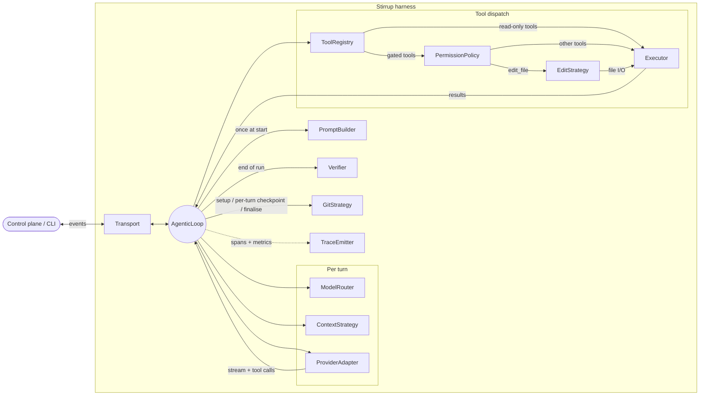

# stirrup

A coding agent harness for Go: a short-lived, declarative agent runtime
where every component — provider, executor, edit strategy, permission
policy, transport — is swappable behind an interface and selected by a
single `RunConfig`.

> **Status:** pre-1.0. Public API is best-effort stable inside `harnessapi`
> and `types`; the rest of `harness/internal/*` is not. The release
> pipeline (tag-driven cross-platform binaries + SBOMs + GHCR image) is
> wired but no `v*.*.*` tag has been cut yet.

## Why stirrup

- **Short-lived job, not a server.** Designed to be started by a control
  plane (or a developer) per task and exit on completion. No long-running
  state, no in-process session store, no cross-tenant memory.
- **Pure-function core.** The agentic loop depends only on interfaces;
  every concrete implementation is injected by `core.BuildLoop`. Replace
  the provider, swap the executor, plug in a new edit strategy without
  touching the loop.
- **Use the LLM only when judgement is needed.** The loop is a state
  machine with LLM calls at decision points, not an LLM with code bolted
  on. Edits, file I/O, command dispatch, permission gates, git, and
  telemetry are deterministic Go.
- **Security-first defaults.** The harness holds API keys and runs
  attacker-influenced code, so it composes five deterministic safety
  rings on top of the usual hardening: kernel-isolation runtime classes,
  egress allowlists, a Cedar-backed policy engine, the Rule of Two
  structural invariant, and a post-edit code scanner. See
  [`docs/sandbox.md`](docs/sandbox.md).
- **Minimal dependency surface.** Provider adapters and the container
  executor are written against documented REST APIs using the Go
  standard library, not vendor SDKs. Every line is auditable.

## Features

**Architecture**
- Twelve interface-based components (provider, router, prompt, context,
  tools, executor, edit, verifier, permissions, transport, git, tracing)
  composed via `RunConfig`.
- Five run modes: `execution`, `planning`, `review`, `research`, `toil`,
  each with mode-aware defaults for read-only invariants and code
  scanning.
- Sub-agent spawning via the `spawn_agent` built-in tool: fresh loop,
  isolated context, capped recursion.

**Providers**
- Anthropic SSE, AWS Bedrock ConverseStream, OpenAI Chat Completions,
  OpenAI Responses API.
- Azure OpenAI works through either OpenAI adapter via `--base-url`,
  `--api-key-header`, and repeatable `--query-param key=value` for
  api-version pins.
- Cross-cloud credential federation: GKE Workload Identity OIDC tokens
  exchanged for AWS STS credentials (no static keys required).

**Sandboxing & safety**
- Container executor over the Docker Engine REST API (Docker or Podman),
  with optional `runc` / `runsc` (gVisor) / `kata*` runtime selection.
- In-process HTTP/CONNECT egress proxy with FQDN allowlist and SNI
  verification (`network.mode == "allowlist"`).
- Cedar policy engine PermissionPolicy alongside `allow-all`,
  `deny-side-effects`, and `ask-upstream`.
- Rule of Two structural invariant: rejects RunConfigs that combine
  untrusted input + sensitive data + external communication unless gated
  by `ask-upstream`.
- Post-edit code scanner (pattern-based pure-Go scanner, optional
  `semgrep` shell-out, or composite) with block / warn semantics.

**Operability**
- Bidirectional gRPC transport (`stirrup job` for K8s) and stdio
  transport for local development.
- OpenTelemetry traces and metrics over OTLP/gRPC; JSONL traces for
  fully local runs.
- Structured `slog` logging with a scrub handler that redacts secrets
  before any handler sees them.
- File-based liveness probes for K8s job entrypoints.

**Evaluation**
- Deterministic eval framework (`stirrup-eval`) with replay providers
  and replay executors.
- Lakehouse interface for production trace metrics, with a file-backed
  adapter shipped for dev and CI.
- Subcommands for live runs, baseline pulls, drift detection, failure
  mining, and lab-vs-production comparison.

## Quick start

### Prerequisites

- Go **1.26.2+** (matches the Dockerfile build image).
- An `ANTHROPIC_API_KEY` env var for the default Anthropic provider, or
  any other provider's credentials (see [`docs/providers`](#providers)).

### Build from source

```sh
git clone git@github.com:rxbynerd/stirrup.git
cd stirrup
go build -o stirrup ./harness/cmd/stirrup
go build -o stirrup-eval ./eval/cmd/eval
```

`just build` is the same thing without typing the paths.

### Run

```sh
./stirrup harness --prompt "Fix the failing test in main_test.go"
```

Or load a fully-populated `RunConfig` from a file:

```sh
./stirrup harness --config examples/runconfig/full.json \
  --prompt "Fix the failing test in main_test.go"
```

### Container image

The release pipeline publishes
`ghcr.io/rxbynerd/stirrup:<tag>` (and `:main` from CI on every merge).
The image is `gcr.io/distroless/static-debian12:nonroot`-based and runs
as `nonroot`.

## Configuration

`stirrup harness` accepts component-selection flags individually, or a
full `RunConfig` JSON file via `--config`. Precedence is **file →
explicit flags → defaults**: flags left at their default value do *not*
override the file.

| Flag | Default | Notes |
|---|---|---|
| `--config <path>` | (none) | JSON `RunConfig` (mirrors `proto/harness/v1/harness.proto`). |
| `--prompt`, positional arg | (required) | User prompt. |
| `--mode`, `-m` | `execution` | One of `execution`, `planning`, `review`, `research`, `toil`. |
| `--name` | (none) | Human-readable session label, attached to logs/traces. Metadata only. |
| `--model` | `claude-sonnet-4-6` | Model id for the static / per-mode router. |
| `--provider` | `anthropic` | One of `anthropic`, `bedrock`, `openai-compatible`, `openai-responses`. |
| `--api-key-ref` | `secret://ANTHROPIC_API_KEY` | A `secret://` reference. API keys never live in `RunConfig`. |
| `--base-url` | (none) | Provider base URL. Required for Azure / gateway scenarios. |
| `--api-key-header` | (none) | Header name. Empty = `Authorization: Bearer`; set to `api-key` for Azure key auth. |
| `--query-param key=value` | (none) | Repeatable. Adds query parameters to every provider request. |
| `--workspace`, `-w` | cwd | Workspace directory. |
| `--max-turns` | `20` | Hard-capped at 100 by `ValidateRunConfig`. |
| `--timeout` | `600` | Wall-clock seconds; capped at 3600. |
| `--trace <path>` | (none) | JSONL trace path. Implies `--trace-emitter jsonl` unless overridden. |
| `--trace-emitter` | `jsonl` | One of `jsonl`, `otel`. |
| `--otel-endpoint` | (none) | Defaults to `localhost:4317` when `--trace-emitter otel`. |
| `--executor` | `local` | One of `local`, `container`, `api`. |
| `--edit-strategy` | `multi` | One of `whole-file`, `search-replace`, `udiff`, `multi`. Composite needs `--config`. |
| `--verifier` | `none` | One of `none`, `test-runner`, `llm-judge`. Composite needs `--config`. |
| `--git-strategy` | `none` | One of `none`, `deterministic`. |
| `--transport` | `stdio` | One of `stdio`, `grpc`. |
| `--transport-addr` | (none) | Required when `--transport grpc`. |
| `--followup-grace` | `0` | Seconds to keep gRPC open for follow-ups; env: `STIRRUP_FOLLOWUP_GRACE`. |
| `--log-level` | `info` | One of `debug`, `info`, `warn`, `error`. |
| `--container-runtime` | (none) | OCI runtime: `runc`, `runsc`, `kata`, `kata-qemu`, `kata-fc`. See [`docs/sandbox.md`](docs/sandbox.md). |
| `--permission-policy-file` | (none) | Cedar policy file. Implies `permissionPolicy.type=policy-engine` when not set elsewhere. |
| `--code-scanner` | (none) | One of `none`, `patterns`, `semgrep`. `composite` is accepted only via `--config` (it requires `codeScanner.scanners`). Empty = mode-aware default. |

`stirrup harness --help` is authoritative; anything not listed above is
covered there. For end-to-end examples see
[`examples/runconfig/`](examples/runconfig/) — full safety-ring config in
[`full.json`](examples/runconfig/full.json), Azure OpenAI in
[`azure-openai.json`](examples/runconfig/azure-openai.json).

## Architecture



The agentic loop owns control flow; everything around it is an
interface that the factory selects per `RunConfig`. The **PromptBuilder**
runs once at start; the **GitStrategy** sets up before the loop,
checkpoints after each turn, and finalises at end-of-run. Each turn the
loop asks the **ModelRouter** which provider+model to use and the
**ContextStrategy** for the message history (compacting if the budget
is tight), then streams the request through the chosen
**ProviderAdapter**. Tool calls in the response are resolved by the
**ToolRegistry**; tools flagged `WorkspaceMutating` or
`RequiresApproval` are gated by the **PermissionPolicy** before
dispatch, while read-only tools go straight to the **Executor**. The
`edit_file` tool dispatches through the **EditStrategy**, which uses
the Executor for file I/O (and is transparently wrapped by the
post-edit code scanner). At end-of-run the **Verifier** validates
output. The **Transport** carries events to and from the control plane
(or stdout for local CLI runs); the **TraceEmitter** records spans and
metrics throughout.

| # | Component | Interface | Implementations |
|---|---|---|---|
| 1 | Model provider | `ProviderAdapter` | `anthropic`, `bedrock`, `openai-compatible`, `openai-responses` |
| 2 | Model router | `ModelRouter` | `static`, `per-mode`, `dynamic` |
| 3 | Prompt builder | `PromptBuilder` | `default` (per-mode templates, composed) |
| 4 | Context strategy | `ContextStrategy` | `sliding-window`, `summarise`, `offload-to-file` |
| 5 | Tool registry | `ToolRegistry` | 7 built-in tools + remote MCP servers; tools may declare an `AsyncHandler` that the loop dispatches over the transport correlator |
| 6 | Executor | `Executor` | `local`, `container` (Docker/Podman), `api` (GitHub) |
| 7 | Edit strategy | `EditStrategy` | `whole-file`, `search-replace`, `udiff`, `multi` |
| 8 | Verifier | `Verifier` | `none`, `test-runner`, `llm-judge`, `composite` |
| 9 | Permission policy | `PermissionPolicy` | `allow-all`, `deny-side-effects` (workspace-mutating tools only), `ask-upstream` (tools whose `RequiresApproval` flag is set), `policy-engine` (Cedar) |
| 10 | Transport | `Transport` | `stdio`, `grpc` (outbound bidi streaming), `null` (sub-agents) |
| 11 | Git strategy | `GitStrategy` | `none`, `deterministic` |
| 12 | Trace emitter | `TraceEmitter` | `jsonl`, `otel` (OTLP/gRPC) |

Whichever edit strategy you pick, the factory wraps it with the
post-edit code scanner — so a `block` finding rolls the write back
without the inner strategy needing to know about it. The eval framework
ships replay doubles for `ProviderAdapter` and `Executor` as well; those
are only reachable via the eval CLI, not selectable through `RunConfig`.

The core loop is a pure function of these interfaces. All dependencies
are injected via `core.BuildLoop` / `core.BuildLoopWithTransport`, which
construct concrete components from a `RunConfig`. See
[`VERSION1.md`](VERSION1.md) for the v1 architecture write-up and
[`AGENTS.md`](AGENTS.md) for the per-package layout.

## Sandboxing & safety

Stirrup composes five deterministic, agent-uncircumventable controls:

1. **Container runtime class** — opt into `runsc` (gVisor) or `kata*`
   for kernel-level isolation when the host daemon supports it.
2. **Egress allowlist** — `network.mode: "allowlist"` starts an
   in-process forward proxy on the host network namespace; the container
   sees only `HTTP_PROXY` / `HTTPS_PROXY` and well-formed CONNECTs to
   approved FQDNs (with SNI verification) get through.
3. **Cedar policy engine** — `.cedar` policy file evaluated per tool
   call, with a configurable non-policy-engine fallback for no-decision
   cases. Starter policies in [`examples/policies/`](examples/policies/).
4. **Rule of Two** — `ValidateRunConfig` rejects RunConfigs that hold
   untrusted input + sensitive data + external communication
   simultaneously unless explicitly overridden, in which case a
   `rule_of_two_disabled` security event is emitted.
5. **Post-edit code scanner** — every successful edit is scanned; a
   `block` finding rolls the write back, a `warn` finding emits
   `code_scan_warning` and continues.

Operator walkthrough with copy-pasteable configs:
[`docs/sandbox.md`](docs/sandbox.md).

## Evaluation

`stirrup-eval` runs declarative `EvalSuite` JSON files, applies judges
(`test-command`, `file-exists`, `file-contains`, `composite`), compares
results against committed baselines, and exits non-zero on regressions
— the gate that runs in CI on every merge to `main`. Beyond pass/fail,
the same binary supports failure mining, drift detection, and
lab-vs-production comparison through the lakehouse interface.

Reference: [`docs/eval.md`](docs/eval.md). CLI: `stirrup-eval --help`.

## Project layout

```text
stirrup/
  proto/harness/v1/  # gRPC + RunConfig schema (source of truth)
  gen/               # generated Go from proto
  types/             # shared types, validation, version
  harness/           # the harness binary and its 12 components
  eval/              # the eval CLI, judges, runner, lakehouse
  examples/          # RunConfig examples + Cedar policy starters
  docs/              # operator-facing guides (sandbox, eval, sessions draft)
```

Per-package detail lives in [`AGENTS.md`](AGENTS.md).

## Security

The README covers the high-level posture; the operator-facing guide is
[`docs/sandbox.md`](docs/sandbox.md), and the disclosure policy is in
[`SECURITY.md`](SECURITY.md).

- **SecretStore** resolves `secret://` references from env vars, files,
  and AWS SSM. Raw API keys are never stored in `RunConfig` and never
  cross the trace boundary (`RunConfig.Redact()`).
- **LogScrubber** runs regex redaction over every log/trace string at
  the `slog.Handler` boundary, so a leak through a misformatted log line
  is structurally impossible.
- **Input validation** uses JSON Schema Draft 2020-12 with external
  schema loading disabled and prototype-pollution keys stripped.
- **HTTP client timeouts** are explicit on every provider adapter and
  the MCP client — `http.DefaultClient` is never used.
- **Environment filtering** at command execution allowlists 27 safe env
  vars; cloud credentials and API keys are blocked from the child
  process.
- **Untrusted context** (file contents, tool output) is wrapped in
  `<untrusted_context>` delimiters before being shown to the model.
- **Stall detection** terminates the loop after 3 repeated identical
  tool calls or 5 consecutive tool failures.
- **Deterministic safety rings** layered on top: see the
  [Sandboxing & safety](#sandboxing--safety) section above.

## Releases

Releases are produced by `.github/workflows/release.yml`, triggered by
pushing a `v*.*.*` tag (or `workflow_dispatch` against an existing tag
for retries):

```sh
git tag -a v1.2.3 -m "Release notes"
git push origin v1.2.3
```

The workflow re-runs `_verify.yml`, then in parallel cross-compiles
`stirrup` and `stirrup-eval` for `linux/{amd64,arm64}` and
`darwin/{amd64,arm64}`, generates SPDX + CycloneDX SBOMs, and aggregates
artifacts into a single `SHA256SUMS` file before publishing the GitHub
Release. Tags containing `-` (e.g. `v1.2.3-rc1`) are marked as
prereleases automatically.

The version label injected into binaries follows this convention:

| Build origin | `stirrup --version` |
|---|---|
| `release.yml` on a tag | `v1.2.3 (ab74b75)` |
| `ci.yml` on `refs/heads/main` | `main (ab74b75)` |
| `ci.yml` on any other ref | `dev (ab74b75)` |
| `go build` / `go run` locally | `dev` |

## Contributing

See [`CONTRIBUTING.md`](CONTRIBUTING.md) for environment setup, build
and test commands, lint policy, and PR conventions.

For an architectural orientation start with [`VERSION1.md`](VERSION1.md);
for per-package details see [`AGENTS.md`](AGENTS.md).

## License

Apache 2.0. See [`LICENSE`](LICENSE).
