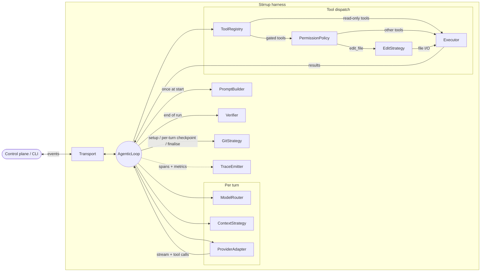

# Architecture

Stirrup is a coding-agent harness designed as a short-lived job. It is
started by a control plane (or a developer) per task, runs the agentic
loop to completion, and exits — there is no in-process session store
and no cross-tenant memory. The core loop is a pure function of its
interfaces; every concrete implementation is injected by the factory
from a single `RunConfig`.

This document is the technical reference. For the operator-facing
deployment posture see [`safety-rings.md`](safety-rings.md); for the
configuration surface see [`configuration.md`](configuration.md).

## Design principles

- **Use the LLM only when judgement is needed.** The loop is a state
  machine with LLM calls at decision points, not an LLM with code
  bolted on. File I/O, command dispatch, edits, permission gates, git,
  and telemetry are deterministic Go.
- **Pure-function core.** The agentic loop depends only on interfaces.
  Every component is injected via `core.BuildLoop` /
  `core.BuildLoopWithTransport`, which constructs concrete types from
  a `RunConfig`. The provider, executor, or edit strategy can be
  swapped without touching the loop.
- **Short-lived job.** No persistent state across tasks. The control
  plane is responsible for conversation history, scheduling, and any
  multi-task continuity.
- **Minimal dependency surface.** Provider adapters and the container
  executor are written against documented REST APIs using the Go
  standard library, not vendor SDKs. Every line is auditable.
- **Cost is a control-plane concern.** The harness tracks tokens for
  budget enforcement but does not maintain pricing tables.

## The thirteen components

Every run is fully described by a `RunConfig` — a declarative
specification that names a concrete implementation for each of the
thirteen interfaces below.

| # | Interface | Implementations | Source |
|---|---|---|---|
| 1 | `ProviderAdapter` | `anthropic`, `bedrock`, `openai-compatible`, `openai-responses`, `gemini` | `harness/internal/provider/` |
| 2 | `ModelRouter` | `static`, `per-mode`, `dynamic` | `harness/internal/router/` |
| 3 | `PromptBuilder` | `default` (per-mode templates, composed) | `harness/internal/prompt/` |
| 4 | `ContextStrategy` | `sliding-window`, `summarise`, `offload-to-file` | `harness/internal/context/` |
| 5 | `ToolRegistry` | seven built-in tools + remote MCP servers | `harness/internal/tool/` |
| 6 | `Executor` | `local`, `container` (Docker/Podman), `api` (GitHub) | `harness/internal/executor/` |
| 7 | `EditStrategy` | `whole-file`, `search-replace`, `udiff`, `multi` | `harness/internal/edit/` |
| 8 | `Verifier` | `none`, `test-runner`, `llm-judge`, `composite` | `harness/internal/verifier/` |
| 9 | `PermissionPolicy` | `allow-all`, `deny-side-effects`, `ask-upstream`, `policy-engine` (Cedar) | `harness/internal/permission/` |
| 10 | `Transport` | `stdio`, `grpc` (outbound bidi streaming), `null` (sub-agents) | `harness/internal/transport/` |
| 11 | `GitStrategy` | `none`, `deterministic` | `harness/internal/git/` |
| 12 | `TraceEmitter` | `jsonl`, `otel` (OTLP/gRPC or OTLP/HTTP) | `harness/internal/trace/` |
| 13 | `GuardRail` | `none`, `granite-guardian` (vLLM), `cloud-judge`, `composite` | `harness/internal/guard/` |

The core loop knows nothing about which implementation it received;
it only invokes the interface methods. That is what makes every
component independently swappable and testable, and what lets the
eval framework substitute replay doubles for the provider and
executor without touching the loop.

## The agentic loop



The `PromptBuilder` runs once at start. The `GitStrategy` sets up
before the loop, checkpoints after each turn, and finalises at
end-of-run. Each turn the loop asks the `ModelRouter` which
provider+model to use and the `ContextStrategy` for the message
history (compacting if the budget is tight), then streams the request
through the chosen `ProviderAdapter`. Tool calls in the response are
resolved by the `ToolRegistry`; the `PermissionPolicy` interprets each
tool's `WorkspaceMutating` and `RequiresApproval` flags before
dispatch. Read-only tools with neither flag go straight to the
`Executor`. The `edit_file` tool dispatches through the
`EditStrategy`, which uses the Executor for file I/O (and is
transparently wrapped by the post-edit code scanner). At end-of-run
the `Verifier` validates output. The `Transport` carries events to
and from the control plane; the `TraceEmitter` records spans and
metrics throughout.

Lifecycle hooks (issue #461) run around this loop, not inside it. A
configured `hook.Runner` (`hook.Noop` when the run has none) executes
`preRun` hooks after `PromptBuilder` builds the system prompt and
before `GitStrategy.Setup` — the deterministic git strategy assumes an
existing checkout, so a clone hook has to create it first — under the
run's own wall-clock context. `postRun` hooks execute after outcome
classification and `GitStrategy.Finalise`, before the run reports
`done`, on a context detached from the run's own cancellation and
deadline (`context.WithoutCancel`) and bounded by the sum of the
configured `postRun` timeouts plus a 30 s margin, so an artifact
upload can still finish after the run's wall-clock timeout has
expired. Hook output never enters the model's context; it is
trace-only, recorded via the optional `trace.HookRecorder` capability
the same way `trace.SystemInstructionsRecorder` is. Sub-agent loops
always get `hook.Noop` — hooks are parent-run-only. Full schema,
defaults, and failure-semantics reference: [`configuration.md`
"Lifecycle hooks"](configuration.md#lifecycle-hooks).

## Modes

Five run modes ship as partial `RunConfig` presets that select
mode-appropriate tools, permissions, and prompt templates. One is
editable (`execution`); the other four are read-only, structurally
enforced by `ValidateRunConfig` to exclude `write_file`,
`edit_file`, and `run_command`.

| Mode | Tools | Default permission | Output shape |
|---|---|---|---|
| `execution` | read, write, shell, search, web fetch, sub-agent | `allow-all` | Code changes |
| `planning` (CLI default) | read-only | `deny-side-effects` | Structured plan |
| `review` | read-only | `deny-side-effects` | Structured review |
| `research` | read-only + web fetch | `deny-side-effects` | Research brief |
| `toil` | read-only + web fetch | `deny-side-effects` | Structured briefing |

`planning` is the CLI default so a bare `stirrup harness --prompt
"..."` invocation has no write or shell capability and passes Rule
of Two (Ring 4) without operator-supplied overrides. Operators who
need editing or shell access opt in explicitly via `--mode
execution`; finer-grained tool and permission selection is
available through `--config` or the individual CLI flags. Modes
are not special — they are saved configurations, and any field can
be overridden per-task via `RunConfig`.

## Provider adapters

Five adapters ship; all are hand-rolled HTTP+SSE against documented
REST APIs.

| Adapter | Wire format | Auth |
|---|---|---|
| `anthropic` | Messages SSE (`net/http` + `bufio.Scanner`) | API key, Anthropic WIF |
| `bedrock` | Bedrock `ConverseStream` (`aws-sdk-go-v2`) | IAM SigV4, IRSA |
| `openai-compatible` | Chat Completions streaming | API key, Azure WIF |
| `openai-responses` | Responses API (`POST /v1/responses`) — distinct wire format from Chat Completions | API key, Azure WIF |
| `gemini` | Vertex AI `:streamGenerateContent` with `?alt=sse` | GCP IAM (ADC) |

The two OpenAI adapters are selected explicitly: there is no
auto-detection between Chat Completions and Responses. The
`openai-compatible` adapter is the entry point for OpenAI itself,
LiteLLM, vLLM, Ollama, and Azure OpenAI when the deployment exposes
Chat Completions; `openai-responses` is for Azure OpenAI Foundry and
any deployment that requires the Responses wire format.

Adapters share a common HTTP client with explicit timeouts (120s
streaming) and bounded error-body reads via `io.LimitReader`. Tool
JSON is accumulated across delta events; context cancellation is
respected.

Per-adapter configuration including base URLs, API-key headers, query
params, and credential federation lives in
[`providers.md`](providers.md).

## Credential federation

The `harness/internal/credential/` package separates *who you are*
from *what credential you need*:

- **TokenSource** fetches identity tokens from the runtime
  environment. Implementations: `gke-metadata` (GKE Workload
  Identity), `file` (k8s projected volumes), `env`, `aws-irsa` (EKS),
  `azure-imds` (AKS), `github-actions-oidc`.
- **`credential.Source`** exchanges tokens (or resolves static
  secrets) into provider-specific credentials. Implementations:
  `StaticSource`, `WebIdentityAWSSource`, `AnthropicWIFSource`,
  `AzureWorkloadIdentitySource`, plus GCP-native paths (ADC, JWT
  service-account flow).

`Source.Resolve()` returns `Resolved.BearerToken`, a refresh-aware
closure each adapter calls per request. Tokens refresh without
restarting the run. `apiKeyRef` and `credential.type` are mutually
exclusive on the same provider; the validator rejects the
combination.

Operator walkthroughs:
[`credential-federation.md`](credential-federation.md),
[`anthropic-wif.md`](anthropic-wif.md),
[`azure-workload-identity.md`](azure-workload-identity.md).

## Executor tiers

The `Executor` interface abstracts where commands run and how files
are accessed. Three tiers ship, selected per-task:

- **`api`** — read-only, backed by the GitHub Contents endpoint over
  stdlib `net/http`. `WriteFile` and `Exec` return errors; URL paths
  are escaped via `url.PathEscape`.
- **`local`** — workspace-scoped local process execution with
  symlink-aware path containment via `filepath.EvalSymlinks`. Used
  for trusted environments (local dev, internal CI).
- **`container`** — Docker Engine REST API directly over a Unix
  socket, with no SDK dependency. Both Docker and Podman are
  supported through the same Engine API; socket auto-detection order
  is `DOCKER_HOST` → `/var/run/docker.sock` →
  `$XDG_RUNTIME_DIR/podman/podman.sock` →
  `/var/run/podman/podman.sock`.

Filesystem executors enforce a 10 MB file size cap, a 1 MB command
output cap, a 30 s default command timeout, and symlink-aware
workspace containment. The container executor is hardened with
`CapDrop: ALL`, `no-new-privileges`, and `NetworkMode: none` by
default; API keys never enter the container.

Two independent timeout ceilings apply to command execution, and they
are deliberately decoupled. The shared `Executor.Exec` hard cap the
`local`, `container`, `k8s`, and `k8s-sandbox` executors clamp
against — 30 minutes as of issue #461, raised from 5 minutes so a
`preRun` lifecycle hook can run a cold `bundle install` — bounds
every real command execution uniformly. The agent-reachable
`run_command` tool clamps independently at 300 s (5 minutes) inside
`builtins/shell.go`, not derived from the executor constant, so
raising the executor's ceiling for hooks does not hand the model a
longer exec budget. The eval-only `ReplayExecutor` ignores its
timeout argument entirely (it replays a recorded output instantly)
and reports its own fixed 5-minute `Capabilities().MaxTimeout`,
unaffected by the raised cap — see [Eval framework](#eval-framework)
below for the resulting hooks-under-replay gap.

The Engine API path was chosen deliberately: the official Docker Go
SDK pulls in moby, containerd, and OCI specs, which conflicts with
the minimal-dependency philosophy. The hand-rolled client is a few
hundred lines of stdlib HTTP per operation.

## Edit strategies

Edit format is one of the highest-leverage harness decisions —
disabling fuzzy patching has been measured at a 9× error increase
on Aider benchmarks, and edit format choice can shift model accuracy
by 30–50 percentage points. Four strategies ship:

- **`whole-file`** — model writes entire file content. Used for new
  files and small files.
- **`search-replace`** — model emits `old_string`/`new_string`
  pairs. The Claude Code default.
- **`udiff`** — model produces a unified diff. Applied with multi
  fallback: exact match, then whitespace-insensitive, then fuzzy
  Levenshtein with a configurable similarity threshold (default
  0.80).
- **`multi`** — unified `edit_file` tool that accepts fields from all
  three other strategies, routes based on which fields are present,
  and falls back to the next applicable strategy if the primary
  fails.

The factory wraps whichever strategy is selected with the post-edit
code scanner (`edit/scanned.go`). A `block` finding rolls the write
back without the inner strategy needing to know; a `warn` finding
emits a `code_scan_warning` event and continues.

## Tools

Twelve built-in tools ship in `harness/internal/tool/builtins/`:

- `read_file`
- `list_directory`
- `grep_files`
- `find_files`
- `edit_file` (registered when any of `edit_file`, `write_file`,
  `search_replace`, or `apply_diff` is in `tools.builtIn`)
- `run_command`
- `git_status`
- `git_changed_files`
- `git_diff`
- `git_show`
- `web_fetch`
- `spawn_agent`

The four `git_*` tools are read-only: they neither mutate the
workspace nor require approval, so the read-only modes (`planning`,
`review`, `research`, `toil`) enable them by default, enabling
inspection of a change set without `run_command`. The executor runs commands
through `sh -c`, so each tool builds its git invocation from a fixed
verb plus single-quoted arguments and validates any `path` (against
the workspace root) or `ref` (rejecting shell metacharacters and a
leading `-`) before it reaches the shell. Output is bounded — `git_diff`
and `git_show` cap on bytes and lines with a truncation sentinel, and
the status/changed-file lists cap on entry count — so a large worktree
cannot exhaust model context. A non-git workspace returns a clear
deterministic error rather than a raw git failure.

`web_fetch` enforces SSRF protection: scheme allowlist (`http`,
`https`), private-IP/reserved-range blocking (RFC 1918, loopback,
link-local, multicast), DNS resolution validation, and a 100 KB
response cap.

### Structured tool results

A `ToolResult` always carries a canonical text rendering in `Content`;
that text is the fallback every provider can accept and is never
dropped. Tools that can describe their output as stable fields
additionally populate an optional typed envelope — `Structured`
(a `json.RawMessage`) plus a `Kind` discriminator naming the payload's
shape. The built-in producers emit eight shapes: `command_result`
(`stdout`, `stderr`, `exit_code`, timeout metadata), `search_result`
(per-match `path`/`line`/`column`/`text`), `find_result`
(workspace-relative paths), `file_excerpt` (line window with
truncation state), `git_status` (current branch plus porcelain
entries with per-path staged/unstaged status letters), `git_changed_files`
(name-status letters per path), `git_diff` (bounded unified-diff text
with a truncation flag), and `git_show` (bounded revision output).
Each shape is a concrete Go struct in
`harness/internal/tool/builtins/structured.go`, not a `map[string]any`,
so the JSON contract is reviewable and stable.

Whether the structured envelope reaches the model on the wire is a
per-provider decision, gated by the `StructuredToolResults` capability
resolved through the [provider-quirks layer](#provider-quirks-layer).
The capability is a cross-provider concept the loop reasons about
uniformly even though each family encodes a structured result
differently:

- **Anthropic** — the Messages API's `tool_result` `content` accepts a
  content-block array. The adapter emits the canonical text part plus a
  text part carrying the structured JSON, so the model receives both
  renderings.
- **Gemini** — `functionResponse.response` is a free-form JSON object.
  The adapter embeds the envelope under `structured`/`kind` alongside
  the canonical `content` key.
- **OpenAI (Chat Completions and Responses)** — the tool message /
  `function_call_output` is a plain string on the wire, so these
  adapters carry no capability and send the text fallback only.

The default is text-only and fail-safe: when the capability is unset or
false — every provider with no rule, including Bedrock — the adapter
sends `Content` verbatim and the wire body is byte-identical to the
pre-structured shape. Structured data is purely additive; an adapter
that has not opted in never sees it. Trace output includes the
structured payload, scrubbed on the same footing as the text (the
secret scrubber runs over `Structured` wherever it appears — the tool
record and the message history).

### MCP

The MCP client (`harness/internal/mcp/client.go`) connects to remote
MCP servers via Streamable HTTP transport (JSON-RPC 2.0 over HTTP
POST). Remote-only by design — there is no stdio subprocess
management. Tool names are namespaced as `mcp_{serverName}_{toolName}`
to avoid collisions. Tools default to `sideEffects: true`. Connection
failures log a warning and skip that server's tools rather than
failing the entire run.

A `tools/call` result is mapped into the
[structured-result envelope](#structured-tool-results): text content
becomes the canonical `Content` fallback, `structuredContent` is
preserved verbatim into `Structured`, and every non-text content item
(resource link, embedded resource, image, audio, or an unrecognised
type) is represented as an explicit typed descriptor — kind, URI,
mime type, and a bounded text prefix for inlined resources — rather
than being silently discarded. The envelope's `Kind` is
`mcp_tool_result`. MCP `annotations` (audience/priority hints on
content items per the 2025-06-18 spec) are intentionally not decoded or
forwarded; they are client-filtering metadata, not model-facing payload.

MCP server output is untrusted, so the preserved structure is bounded
at the trust boundary: `structuredContent` larger than the size cap is
dropped (with a marker noting the omission), embedded-resource text is
truncated to a per-resource limit, and image/audio bytes and binary
blobs are never inlined — the URI is the durable handle the model uses
to re-fetch them. The preserved content is not scrubbed in the bridge;
it rides the same dispatch path as every other tool result, so it
passes through the secret scrubber before reaching a trace or the model
history.

### Provider-facing tool name normalization

Provider tool/function names have stricter constraints than what the
registry enforces — MCP-derived names with hyphens, dots, spaces or
non-ASCII can be registered locally but rejected by a provider on the
wire. The `harness/internal/tool/toolname` package centralises a
per-provider naming policy and is applied by a `NormalizingAdapter`
that wraps every `ProviderAdapter` at factory time (the outermost
wrap, outside any batch wrapper). The wrapper rewrites tool
definitions and `tool_use` block names on egress and reverse-maps
inbound `tool_call` events back to the registry-side name so dispatch
continues to resolve by the original identifier.

Effective rules per provider type:

- **Anthropic / OpenAI (Chat Completions and Responses) / Bedrock** —
  `[A-Za-z0-9_-]{1,64}`. Leading digits allowed.
- **Gemini (Vertex AI)** — `[A-Za-z_][A-Za-z0-9_]{0,63}`. Hyphens are
  not allowed and a leading digit is replaced with `_<digit>`.
- **Unknown providers** — fall through to the strictest policy
  (Gemini's) so a new adapter cannot regress until its policy is
  added.

The Bedrock entry is the conservative union of the Anthropic and
OpenAI-compatible rules — chosen because Bedrock fronts both
Anthropic-backed and Mistral/Llama-backed models — not a validated
Converse API guarantee. Per-model constraints land in Wave 2 (#221).

Substitution replaces every disallowed character with `_`. Names that
exceed the length cap are hard-truncated; names that collide after
sanitization gain a deterministic six-hex-character SHA-256 suffix
derived from the internal name so two long names that share a common
prefix stay distinguishable. A collision that cannot be resolved
(e.g. the same internal name registered twice) fails the stream
before any request is issued — silent aliasing would route a
tool_call to the wrong handler.

### Provider-quirks layer

Beneath the tool-name normalization layer, each concrete adapter
resolves a per-(provider, model) `ProviderQuirks` value at the top
of every `Stream()` call. The layer handles wire-shape and
behaviour divergences that the canonical `ProviderAdapter`
interface cannot express: OpenAI reasoning-class sampling-param
omissions, Z.ai GLM legacy field names, Gemini 3.x
`thoughtSignature` capture, DeepSeek `reasoning_content` capture
and replay. The `NormalizingAdapter` wraps the concrete adapter
from the outside; the quirks resolution sits inside the adapter's
`Stream()` body. Both layers compose without either knowing about
the other.

Full reference: [`provider-quirks.md`](provider-quirks.md).

### Sub-agent spawning

The `spawn_agent` tool creates a fresh `AgenticLoop` with its own
message history, running synchronously as a tool call. The sub-agent
reuses the parent's provider, executor, and tools (except
`spawn_agent` itself — preventing infinite recursion). It uses a
`NullTransport` (no streaming to the control plane), `NoneVerifier`,
`NoneGitStrategy`, and a `captureTransport` that records text deltas
for output extraction. Max turns is capped at 20, default 10.

The `SubAgentSpawner` function type in `tool/builtins` decouples the
tool from the `core` package, avoiding circular imports. The factory
provides the concrete closure.

## Permission policies

Four implementations gate side-effecting tool calls:

- **`allow-all`** — every tool call proceeds. Default for
  `execution` mode.
- **`deny-side-effects`** — workspace-mutating tools (`write_file`,
  `run_command`, `edit_file`) are blocked outright. Read-only tools
  with network or budget exposure (`web_fetch`, `spawn_agent`) are
  still allowed; choose `ask-upstream` when those tools should prompt.
  Default for read-only modes.
- **`ask-upstream`** — tools whose `RequiresApproval` flag is set
  prompt the control plane via a `permission_request` event before
  dispatch. Only useful with the `grpc` transport; `stdio` has no
  upstream to ask and hangs on the first side-effecting tool call.
- **`policy-engine`** — Cedar policy file evaluated per tool call as
  `(principal=User::"<runId>", action=Action::"tool:<name>", resource=Tool::"<name>", context={input, workspace, dynamicContext})`.
  Falls back to a configured non-policy-engine policy on no-decision.
  Starter policies live in [`examples/policies/`](../examples/policies/).

The `policy-engine` policy is one of the five safety rings; see
[`safety-rings.md`](safety-rings.md) for the safety walkthrough and
[`configuration.md#tool-permission-flags`](configuration.md#tool-permission-flags)
for the operator-facing flag matrix.

## Context strategies

Three strategies manage message history as it approaches the token
limit:

- **`sliding-window`** — drops the oldest messages beyond a
  configurable token budget.
- **`summarise`** — summarises old turns into a single condensed
  message via a separate (cheaper) model call.
- **`offload-to-file`** — writes full tool results to workspace
  files and replaces the in-context message with a pointer.

Token estimation accounts for per-message overhead (4 tokens),
per-block overhead (3 tokens), tool-related metadata, system prompt
tokens, and tool definition tokens.

## Verifiers

The `Verifier` adds an outer loop around the agentic loop: run until
the model says done, verify, and if verification fails, feed feedback
back as a user message. Three implementations ship:

- **`test-runner`** — runs a shell command, parses exit code and
  output.
- **`llm-judge`** — calls a cheap model (default Haiku) with a
  structured prompt and parses a JSON verdict
  `{"passed": bool, "feedback": string}`. Malformed responses are
  treated as failures with the raw response preserved in details.
- **`composite`** — chains multiple sub-verifiers.

## Transport

- **`stdio`** — NDJSON to stdout, reads stdin. Used for local and
  interactive development.
- **`grpc`** — Bidi streaming client implementing the `Transport`
  interface. The harness connects *outbound* to the control plane,
  not the other way around. Proto definitions in
  [`proto/harness/v1/harness.proto`](../proto/harness/v1/harness.proto),
  generated with Buf (`buf generate`). See
  [`deployment.md`](deployment.md) for the K8s job entrypoint and
  the control-plane handshake.
- **`null`** — no-op transport used by sub-agents.

## Trace emitters

- **`jsonl`** — newline-delimited JSON to a file path. Used for
  local development and replay.
- **`otel`** — OpenTelemetry traces via OTLP/gRPC (default) or
  OTLP/HTTP (`http/protobuf`). Default endpoint: `localhost:4317` for
  gRPC. The trace emitter creates a root `run` span with child spans
  for turns, tool calls, provider streaming, context compaction,
  verification, permission checks, and git operations. See
  [`observability-cloud.md`](observability-cloud.md) for cloud
  backend setup.

The provider-quirks layer (see
[`provider-quirks.md`](provider-quirks.md)) surfaces resolution
observability through both slog records and OTel span attributes
so log-only and trace-only consumers each see which rules fired.
Each `ProviderAdapter.Stream` call emits an `openai quirks
resolved` (or `gemini quirks resolved`) DEBUG record naming every
contributing rule's description, and sets the matching
`provider.quirk.applied` attribute on the active span. When a
rule's `OmitSamplingParams` suppresses a caller-supplied non-nil
`Temperature`, an `openai quirks suppressed caller temperature`
WARN record fires naming the responsible rule. When a rule
registers `ReplayFields` paths and any value is captured during
the stream, a `quirks replay fields captured` DEBUG record fires
on stream exit summarising `{count, total_len}` per path — and
the same totals are attached to the span as
`replay_fields_captured.count` / `.total_len`. Length-only on
both surfaces; never the captured values themselves.

The `harness/internal/observability/` package emits OTel metrics
alongside tracing: 13 counters (`stirrup.harness.runs`, `.turns`,
`.tokens.input`, `.tokens.output`, `.tool_calls`, `.tool_errors`,
`.tool_failures`, `.provider.requests`, `.provider.errors`,
`.context.compactions`, `.security.events`, `.verification.attempts`,
`.stalls`), 5 histograms (run, turn, tool-call duration; provider
latency; TTFB), and 1 UpDownCounter (context token estimate). All
instruments use standard attributes (`run.mode`, `provider.type`,
`tool.name`). `NewNoopMetrics()` provides a zero-cost no-op when
metrics are disabled.

`stirrup.harness.tool_failures` decomposes `.tool_errors` by a
bounded `category` label drawn from the `ToolFailureCategory` enum
in `harness/internal/observability/toolfailure.go`. The metric is
labelled `(provider.type, provider.model, tool.name, category,
run.mode)` so dashboards can attribute failures to specific model
selections. Categories cover dispatch-site failures
(`unknown_tool`, `schema_validation_failed`, `permission_denied`,
`permission_error`, `security_guard_denied`, `guardrail_denied`,
`handler_error`, `handler_missing`), async-tool failures
(`async_preflight_error`, `async_transport_unavailable`,
`async_timeout`, `async_cancelled`, `async_upstream_error`,
`async_panic`, `async_internal_error`), provider-side failures
during tool-bearing turns (`provider_request_failed`,
`provider_stream_failed`), and stall-detector terminations
(`stall_repeated_calls`, `stall_consecutive_failures`). The same
category is co-emitted into `ToolCallTrace.ErrorCategory` on each
failed `tool_call_record` event so JSONL traces carry the
identical taxonomy.

Resource attributes (`service.name`, `service.namespace`,
`deployment.environment`, `service.instance.id`, `harness.run.mode`)
are built once per process. Stirrup's overlay wins over
`OTEL_RESOURCE_ATTRIBUTES` on key conflicts. High-cardinality fields
(`run.id`, `run.provider`, `run.model`) stay at span/instrument level
to avoid metric series cardinality explosion. `tool_failures` keeps
its label set bounded because `category` is a closed enum and
`tool.name` is the internal canonical tool identifier (not a raw
schema path or error fragment).

## Stall detection

The `stallDetector` (`harness/internal/core/stall.go`) tracks
consecutive identical tool calls and consecutive failures. The loop
terminates with `stop_reason: "stalled"` after 3 repeated identical
calls (same name + same input) or `"tool_failures"` after 5
consecutive failures.

## Heartbeat and health probes

The agentic loop emits `heartbeat` events on the transport every 30
seconds during execution. For K8s jobs, a file-based liveness probe
(`harness/internal/health/probe.go`) writes `/tmp/healthy` after the
ready event and removes it on shutdown.

## Eval framework

The `eval/` module is a separate Go module that produces the
`stirrup-eval` binary. It uses two replay doubles to evaluate runs
deterministically:

- **`ReplayProvider`** (`harness/internal/provider/replay.go`)
  implements `ProviderAdapter` by replaying recorded
  `TurnRecord.ModelOutput` as stream events. Atomic turn counter, no
  API calls.
- **`ReplayExecutor`** (`harness/internal/executor/replay.go`)
  implements `Executor` by replaying recorded tool call outputs
  indexed by `(toolName, canonicalInput)`. Tracks writes for
  assertion via `Writes()`.

Lifecycle hooks (issue #461) dispatch through `Executor.Exec` directly
— outside the `(toolName, canonicalInput)` indexing `ReplayExecutor`
looks up against — so a recorded-replay eval of a run that used hooks
is undefined behaviour in v1: there is no recorded hook execution for
`ReplayExecutor` to match against. Suites that need lifecycle hooks
should use live evaluation until replay support lands as a follow-up.

Suites are authored in HCLv2. The runner clones repos, invokes the
harness binary, parses JSONL traces, and applies judges
(`test-command`, `file-exists`, `file-contains`, `composite`). The
reporter diffs two `SuiteResult` sets to flag regressions and
improvements.

Full reference: [`eval.md`](eval.md).

## Key constants

| Constant | Default | Hard cap |
|---|---|---|
| `MaxTurns` | 20 | 100 |
| `Timeout` (wall-clock) | 600 s | 3600 s |
| `FollowUpGrace` | 0 s | 3600 s |
| `MaxTokenBudget` | unset | 50 M |
| `MaxCostBudget` | unset | $100 |
| File read/write size | 10 MB | — |
| `Executor.Exec` output (hooks/verifiers/git helpers) | 1 MB | — |
| `run_command` inline model output | 32 KiB combined | configurable |
| `run_command` capture per stream | 50 MiB | 256 MiB |
| `run_command` capture per run | 500 MiB | 2 GiB |
| Command timeout (`run_command` tool) | 30 s | 5 min |
| `Executor.Exec` hard cap (`local`/`container`/`k8s`/`k8s-sandbox`) | 30 s | 30 min |
| Web fetch response | 100 KB | — |
| `temperature` | 0.1 | — |
| `max_tokens` | 64 000 | — |
| Default model | `claude-sonnet-4-6` | — |
| Lifecycle hook timeout (`hooks[].timeoutSeconds`) | 300 s | 1800 s (30 min) |
| Lifecycle hooks per phase (`hooks.preRun` / `hooks.postRun`) | — | 32 |

The `temperature` default is resolved unconditionally for every
provider call; it is not sent on the wire to Claude Opus 4.7+, Claude
Sonnet 5, or Claude Fable 5 / Mythos 5, which reject a non-default
value with an HTTP 400. See [`provider-quirks.md`](provider-quirks.md).

## External dependencies

Provider adapters and the container executor use hand-rolled HTTP
clients against documented REST APIs — no vendor SDK dependency
trees. The accepted exceptions and their justifications:

| Dependency | Rationale |
|---|---|
| `github.com/spf13/cobra` | CLI framework |
| `github.com/santhosh-tekuri/jsonschema/v6` | JSON Schema Draft 2020-12 validation for tool inputs |
| `aws-sdk-go-v2` | Bedrock (SigV4), STS (`AssumeRoleWithWebIdentity`), SSM SecretStore |
| `k8s.io/client-go` (with `k8s.io/api`, `k8s.io/apimachinery`, `k8s.io/utils`) | Kubernetes API server authentication (in-cluster service-account tokens, kubeconfig OIDC/exec credential plugins) and API discovery are materially harder to hand-roll than Docker's UNIX-socket REST. The client-go transport layer is also the only supported path for TLS client certificates issued by the cluster CA. Accepted trade-off: ~25 indirect transitive deps. |
| `google.golang.org/grpc` + `google.golang.org/protobuf` | gRPC transport |
| `go.opentelemetry.io/otel` + OTLP exporter | Traces and metrics (gRPC and HTTP/protobuf) |
| `golang.org/x/oauth2` | GCP ADC, GCP service-account JWT flow, WIF token refresh |
| `github.com/cedar-policy/cedar-go` | Cedar policy engine |
| `github.com/hashicorp/hcl/v2` | Eval suite parsing (eval module only; harness binary unaffected) |

## Embedding API

The public embedding surface is `harness/harnessapi/`. Everything
under `harness/internal/*` is intentionally not part of the public
API.

```go
import "github.com/rxbynerd/stirrup/harness/harnessapi"

loop, err := harnessapi.BuildLoopWithTransport(ctx, runConfig, transport)
if err != nil { /* handle */ }
err = loop.Run(ctx)
```

For per-package detail see [`AGENTS.md`](../AGENTS.md). For the gRPC
contract and control-plane handshake see
[`deployment.md`](deployment.md).
