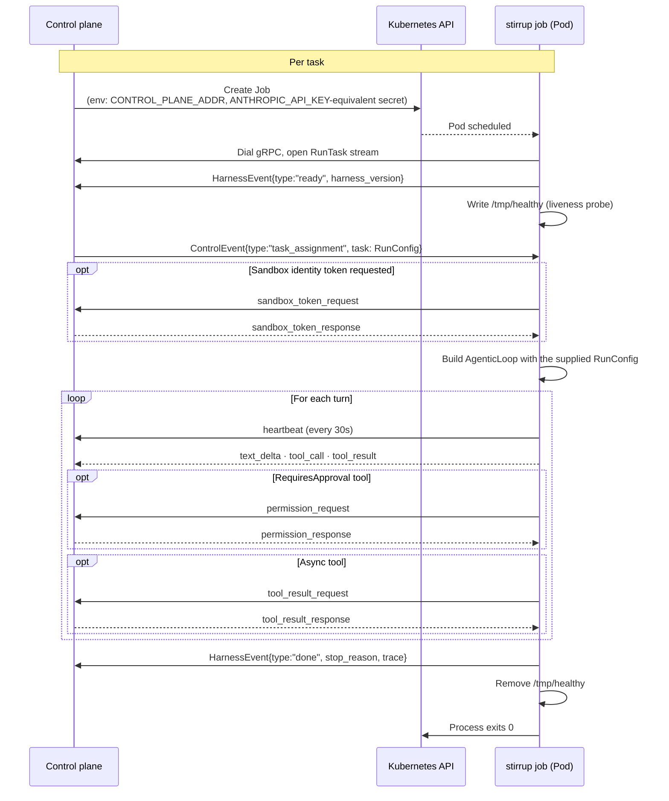

# Production deployment

Stirrup is designed to be deployed as a short-lived Kubernetes job
that talks to a long-running control plane over gRPC. This document
describes the contract between the two, the container image, and the
release process. For local development the [README](../README.md)
covers the basics.

## Architecture



The harness *connects outbound* to the control plane. There is no
inbound port to expose, no service mesh hop to configure, and no
shared filesystem with the control plane. The only inputs are the
environment variables passed at Pod creation time and whatever the
control plane sends over the bidi stream.

## Transport security posture (v0.1)

> **The gRPC transport is plaintext and unauthenticated.** The
> harness dials the control plane with
> `insecure.NewCredentials()`, and `TransportConfig` exposes only
> `{type, address}` — there is no TLS, token, or mTLS knob on the
> config surface in v0.1.

v0.1 targets single-operator, self-hosted deployment. The design
assumes a trusted network path between job Pods and the control
plane; acceptable shapes are:

- **Same host** — control plane and harness on one machine,
  dialling over loopback.
- **Private network** — a private VPC / cluster network where the
  control-plane address is not reachable from untrusted networks.
- **Mesh-provided mTLS** — a service mesh (Istio, Linkerd) that
  transparently encrypts and authenticates Pod-to-Pod traffic
  outside the harness process.

Do not point `--transport-addr` / `CONTROL_PLANE_ADDR` across an
untrusted network: everything on the stream — prompts, tool
results, permission responses — would transit in cleartext, and
any endpoint that can reach the harness's dial target could pose
as the control plane. Secrets are less exposed than they appear
(API keys travel as `secret://` references, never raw values, and
the transport scrubs secret-shaped strings from outbound events) —
except the sandbox identity token (`ControlEvent.token`), which is
the raw signed JWT itself and receives no such protection — but the
stream contents and the control channel itself are unprotected.

Transport TLS configuration is planned post-v0.1. The internal
transport constructor already accepts TLS credentials
(`transport.WithTLSCredentials`); what is missing is the
`RunConfig` / CLI surface to reach it, so today the option is
available only to Go embedders wiring the transport directly.

## The `stirrup job` subcommand

`stirrup job` is the K8s entrypoint. It takes no flags — everything
comes from the environment and from the `RunConfig` delivered as the
first `ControlEvent` on the stream.

### Required environment variables

| Variable | Purpose |
|---|---|
| `CONTROL_PLANE_ADDR` | gRPC target address of the control plane (e.g. `control-plane.svc:9090`). |

### Optional environment variables

| Variable | Purpose |
|---|---|
| `CONTROL_PLANE_SESSION_ID` | Session correlation ID echoed back in the initial `ready` event so the control plane can match this gRPC stream to the session that launched it. |
| `STIRRUP_FOLLOWUP_GRACE` | Seconds to keep the gRPC stream open after the agentic loop completes, so the control plane can deliver follow-up `user_response` events. Capped at 3600 s. |

Per-provider secrets (Anthropic API key, AWS / GCP / Azure
credentials) are *not* passed via stirrup-specific env vars — they
follow the configured `secret://` references in the `RunConfig` or
the credential federation chain (IRSA, GKE Workload Identity, Azure
IMDS, GitHub Actions OIDC). See
[`credential-federation.md`](credential-federation.md).

### Lifecycle

1. **Connect.** The harness dials `CONTROL_PLANE_ADDR` over gRPC and
   opens a single `RunTask` bidi stream for the lifetime of the
   task.
2. **Ready.** The harness sends a `HarnessEvent{type:"ready", harness_version}`
   so the control plane can verify the binary version before
   dispatching work.
3. **Liveness.** A liveness probe file is written to `/tmp/healthy`
   so the K8s readiness/liveness probes have something to inspect.
4. **Wait for assignment.** The harness blocks on a
   `ControlEvent{type:"task_assignment"}` carrying the `RunConfig`,
   with a 5-minute timeout. A `cancel` event received before
   assignment is honoured: the harness exits cleanly without
   running anything.
5. **Sandbox identity token** *(optional)*. When the run wants a
   sandbox identity token (e.g. to authenticate a git proxy such as
   Haybale), the harness sends a
   `HarnessEvent{type:"sandbox_token_request"}` and blocks, fail-closed,
   for up to 60 seconds on the matching `sandbox_token_response` —
   before any sandbox is created. See [Sandbox identity token
   issuance](#sandbox-identity-token-issuance-control-plane-implementers)
   below for the full contract, and [configuration.md's "Sandbox
   identity and git-proxy
   wiring"](configuration.md#sandbox-identity-and-git-proxy-wiring)
   for the `executor.sandboxIdentity` / `executor.gitProxy`
   `RunConfig` fields that request it.
6. **Build and run.** Once the `RunConfig` arrives, the wall-clock
   timeout is applied to the context, the agentic loop is built via
   `core.BuildLoopWithTransport` reusing the existing gRPC transport,
   and execution begins.
7. **Stream events.** Throughout the run the harness emits
   `text_delta`, `tool_call`, `tool_result`, `heartbeat` (every 30
   s), and — depending on the permission policy — `permission_request`
   events. Async tools may emit `tool_result_request`.
8. **Done.** A final `HarnessEvent{type:"done", stop_reason, trace}`
   carries the run metrics and the reason the loop ended
   (`end_turn`, `max_turns`, `timeout`, `stalled`, `tool_failures`,
   `cancelled`, `budget_exceeded`, `error`, `setup_failed`,
   `hook_failed`). `error`, `setup_failed`, and `hook_failed` are the
   early-termination outcomes — a build-system-prompt failure, a
   `GitStrategy.Setup` failure, or (issue #461) a fatal `preRun` /
   `postRun` lifecycle hook failure — and, like every other outcome,
   are always paired with a `done` event and a `RunResult` on the
   configured `resultSink`, even though the harness process's own Go
   error return is also non-nil for these. The nested `trace.outcome`
   is the canonical terminal status for downstream analytics — the
   full `RunTrace.Outcome` set, which adds `success`,
   `verification_failed`, `verification_error`, and `max_tokens` on
   top of the loop's stop reasons. `trace.stop_reason` mirrors it for
   backward compatibility.
9. **Follow-up grace** *(optional)*. If `STIRRUP_FOLLOWUP_GRACE > 0`,
   the stream stays open for that many seconds so the control plane
   can deliver `user_response` events that resume the loop.
10. **Exit.** The liveness probe file is removed; the process exits 0
    on success or non-zero on transport / build / runtime failure.

The full event vocabulary lives in
[`proto/harness/v1/harness.proto`](../proto/harness/v1/harness.proto) —
that is the source of truth for the wire contract.

### Sandbox identity token issuance (control-plane implementers)

Some sandbox executors need a short-lived credential to authenticate
outbound git operations through a proxy such as
[Haybale](https://github.com/rxbynerd/haybale). The harness never
holds a signing key or a long-lived credential itself; it requests a
token from the control plane once per run, over the same `RunTask`
stream used for everything else.

- **`sandbox_token_request`** (`HarnessEvent`) — sent once per run,
  after `task_assignment` and before the sandbox is created. Carries
  `request_id` (correlation) and `audience`, the intended JWT `aud`
  claim (e.g. `https://haybale.internal`). The event deliberately
  carries no harness-asserted identity field: the control plane
  derives the run identity from the authenticated stream the task was
  assigned on, not from anything in the request body.
- **`sandbox_token_response`** (`ControlEvent`) — echoes `request_id`
  and carries `token`, the signed JWT. `token` is sensitive: the
  harness never logs, traces, or persists it, and it never enters
  `RunConfig`. A control plane that cannot issue a token responds
  with `is_error: true` and a human-readable `reason` rather than
  staying silent — the harness treats a missing or late response the
  same way it treats an explicit error.

**Transport trust boundary.** Unlike API keys, `token` is not a
`secret://` reference — it is the raw signed JWT, and it rides the
same plaintext-by-default `RunTask` stream as every other event (see
[Transport security posture](#transport-security-posture-v01)).
Requesting a sandbox identity token therefore requires, at minimum,
the same-host / private-network / mesh-mTLS posture described there:
the token is long-lived (see Token lifetime, below) and unencrypted
by default, so it is a materially higher-value credential than the
rest of the stream. Do not opt a run into the sandbox identity token
flow across an untrusted network until transport TLS — the internal
transport already accepts `transport.WithTLSCredentials`, but there
is no `RunConfig` / CLI surface to reach it yet — is wired to a
config surface.

A control plane implementing this contract must:

1. Mint a JWT per the consuming proxy's identity contract — for
   Haybale, its [`docs/jwt-identity.md`](https://github.com/rxbynerd/haybale/blob/main/docs/jwt-identity.md).
   The mechanism is generic ("sandbox identity token"), not
   Haybale-specific: other consumers (artifact registries, package
   proxies) can reuse the same exchange with their own token
   contract.
2. Sign with its own key and publish the corresponding JWKS at the
   URL the consuming proxy is configured to fetch from. Stirrup never
   holds a signing key.
3. Scope the `sub` claim to `run-<RunID>` (the `RunConfig.run_id` of
   the run being serviced), so the proxy's audit log correlates with
   stirrup's own tracing.
4. Validate `audience` against its own configured audience list
   before minting — the harness sends `audience` as a hint, not an
   authorization; a control plane that mints against an unvalidated
   value has no assurance the resulting token is scoped to a
   consumer it actually intends to trust.
5. Provision the per-run scope — e.g. a `policy.yaml`-style rule
   confining `run-<RunID>` to exactly the repos and verbs the run
   needs — before or as part of issuing the token. This is a
   provisioning prerequisite the control plane or operator handles;
   it is not part of the wire exchange itself.

**Fail-closed wait.** The harness blocks on the matching
`sandbox_token_response` for up to 60 seconds — the same default as
the `ask-upstream` permission-response timeout. A response that
arrives late, or not at all, aborts the run before the sandbox is
created; the run ends with `done{stop_reason:"error"}` rather than
leaving a partially-provisioned, tokenless sandbox behind.

**Token lifetime.** Haybale recommends an `exp` of 15 minutes or
less, but the token is baked into the sandbox environment once, at
creation time, and in-sandbox refresh is out of scope for now (it
requires a bootstrap-auth channel that does not exist yet). The v1
posture is that the control plane issues `exp` covering the run's
configured wall-clock budget (plus slack), and narrows blast radius
through per-token scope claims and proxy-side policy instead of a
short lifetime. The optional `sandbox_token_response.expires_at`
field (Unix seconds) lets the harness compare the token's actual
expiry against the run's budget and emit a scrub-safe warning when
the token is shorter-lived than the run — a signal that the run may
fail partway through with authentication errors rather than a
stirrup-side bug. The harness performs that comparison
(`sandboxidentity.WarnIfExpiresBeforeBudget`) immediately after a
successful token exchange, before the sandbox is created.

**Follow-up for `docs/CONTROL_PLANE.md`** (tracked, not part of this
change): the broader control-plane design doc lives on the unmerged
`control-plane` branch. When that branch lands, add
`sandbox_token_request` / `sandbox_token_response` as rows in its
§2.1 event table alongside the existing `permission_request` /
`tool_result_request` pairs, and note that this exchange participates
in the mutual-partial-trust posture recorded in that doc's §1.1. This
document is normative for the wire contract in the meantime.

## Container image

Releases publish two image tags to GitHub Container Registry:

- `ghcr.io/rxbynerd/stirrup:<tag>` for tagged releases (`v1.2.3`).
- `ghcr.io/rxbynerd/stirrup:main` from CI on every merge to `main`.

The image is `gcr.io/distroless/static-debian12:nonroot`-based: a
single statically-linked binary, no shell, no package manager, runs
as `nonroot` (uid 65532).

## Release process

Releases are tag-driven via `.github/workflows/release.yml`. To cut
one:

```sh
git tag -a v1.2.3 -m "Release notes"
git push origin v1.2.3
```

`workflow_dispatch` against an existing tag re-runs the workflow for
retries.

The workflow:

1. Re-runs the verify job (build + test).
2. Cross-compiles `stirrup` and `stirrup-eval` for
   `linux/{amd64,arm64}` and `darwin/{amd64,arm64}` in parallel.
3. Generates SPDX and CycloneDX SBOMs.
4. Aggregates artifacts under a single `SHA256SUMS` manifest.
5. Publishes a GitHub Release. Tags containing `-`
   (e.g. `v1.2.3-rc1`) are marked as prereleases automatically.

Artifact signing (cosign / Sigstore) is intentionally out of scope
for now; a commented-out signing seam sits in `release.yml` between
the SHA256SUMS step and the release-create step.

## Version labels

The version label baked into binaries follows this convention:

| Build origin | `stirrup --version` output |
|---|---|
| `release.yml` on a tag | `v1.2.3 (ab74b75)` |
| `ci.yml` on `refs/heads/main` | `main (ab74b75)` |
| `ci.yml` on any other ref | `dev (ab74b75)` |
| `go build` / `go run` locally | `dev` |

The labels are injected via `-ldflags` against
`github.com/rxbynerd/stirrup/types/version.{version,commit}`.

## CI

`.github/workflows/ci.yml` runs three jobs on each push:

- **`verify`** — `go test` plus binary builds for the `types`,
  `harness`, and `eval` modules. Runs on every push and PR via the
  reusable `_verify.yml` workflow.
- **`eval-gate`** — runs the baselined suites in `eval/suites/`
  against `eval/baselines/` on every push, pinned to a cheap model
  (Claude Haiku 4.5), exits non-zero on regressions, uploads
  results as artifacts. A stronger-model sweep (Sonnet 5, Opus 4.8)
  runs at release time via `release.yml::eval-extended`.
- **`publish-container`** — builds and pushes the image to GHCR on
  the `main` branch only, after `verify` passes.

The Anthropic WIF smoke test (`smoke-anthropic.yml`) is a separate
gated workflow that exercises the federation flow end-to-end.

## Operator checklist

Before deploying:

1. Decide a deployment posture using
   [`safety-rings.md`](safety-rings.md). The safe defaults for
   first-run production are: `executor.type=container`,
   `executor.runtime=runsc`, `network.mode=allowlist`,
   `permissionPolicy.type=policy-engine` with a starter policy from
   [`examples/policies/`](../examples/policies/), `codeScanner.type=patterns`,
   and Rule of Two enforcement on (the default).
2. Wire credentials through the credential federation layer rather
   than baking API keys into Pod env vars. See
   [`credential-federation.md`](credential-federation.md).
3. Configure observability: OTLP/gRPC to your collector or OTLP/HTTP
   to a managed gateway. See
   [`observability-cloud.md`](observability-cloud.md).
4. Set `livenessProbe.exec.command: ["sh", "-c", "test -f /tmp/healthy"]`
   on the Pod. (The image has no shell, so use `[""]` style probes
   only when adding a debug sidecar.)
5. Enforce a `Job.spec.activeDeadlineSeconds` slightly larger than
   `RunConfig.timeout` so K8s reaps any stuck Pod even if the
   harness's own wall-clock timeout fails to fire.
6. Confirm the network path between job Pods and the control plane
   is trusted (private network or mesh mTLS) — the gRPC transport
   itself is plaintext and unauthenticated in v0.1. See
   [Transport security posture](#transport-security-posture-v01).

## Embedding the harness

The public Go API surface is `harness/harnessapi/`. Everything under
`harness/internal/*` is intentionally not part of the public API.

```go
import "github.com/rxbynerd/stirrup/harness/harnessapi"

loop, err := harnessapi.BuildLoopWithTransport(ctx, runConfig, transport)
if err != nil { /* handle */ }
err = loop.Run(ctx)
```

Use this when you need the agentic loop in-process — for example, in
a single-binary tool that bundles its own control-plane logic. For
typical multi-tenant deployments, run the binary as a Job and let
the gRPC contract do the talking.
