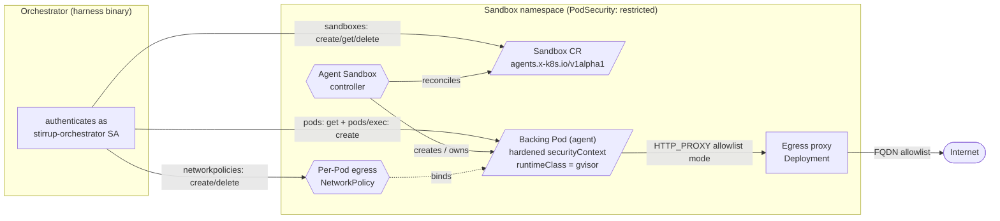

# Kubernetes Agent Sandbox executor (`k8s-sandbox`)

The `k8s-sandbox` executor runs the agent inside a hardened, single-use
sandbox Pod that is **provisioned through the GKE Agent Sandbox
controller** rather than created directly. The executor submits an
`agents.x-k8s.io/v1alpha1` **Sandbox** custom resource; the controller
materialises the backing Pod; the executor then drives command execution
and file I/O over the `pods/exec` subresource — the same machinery the
[`k8s` executor](k8s.md) uses once the Pod exists.

This is a variant of the `k8s` executor, not a replacement. The two share
everything below the provisioning layer: the hardened Pod spec, the
per-Pod egress `NetworkPolicy`, the exec/file-I/O core, and every `K8s*`
configuration field. They differ only in *how the Pod comes into being* —
direct Pod create vs. the Sandbox CRD. Read [`k8s.md`](k8s.md) first for
the shared foundations; this document covers only the deltas.

The executor implementation is
[`harness/internal/executor/agentsandbox.go`](../../harness/internal/executor/agentsandbox.go)
and [`agentsandbox_api.go`](../../harness/internal/executor/agentsandbox_api.go);
every field and behaviour documented here is cross-checked against those
files. The reference manifests live under
[`examples/k8s/agent-sandbox/`](../../examples/k8s/agent-sandbox/).

## Contents

- [When to use it vs. the `k8s` executor](#when-to-use-it-vs-the-k8s-executor)
- [Architecture](#architecture)
- [The v1alpha1 vs. v1beta1 API skew](#the-v1alpha1-vs-v1beta1-api-skew)
- [The four GKE admission deltas](#the-four-gke-admission-deltas)
- [Egress is unchanged](#egress-is-unchanged)
- [The controller-owned TTL GC backstop](#the-controller-owned-ttl-gc-backstop)
- [RBAC delta](#rbac-delta)
- [Configuration](#configuration)
- [Testing against a real cluster](#testing-against-a-real-cluster)
- [Deferred value-adds](#deferred-value-adds)

## When to use it vs. the `k8s` executor

| Executor | Pod provisioned by | Use when |
|---|---|---|
| `k8s` | the executor itself (direct Pod create) | The cluster runs no Agent Sandbox controller, or a runtime other than gVisor is required (`runc`, `kata-*`). The executor owns the Pod's full lifecycle. |
| `k8s-sandbox` | the GKE Agent Sandbox controller (via the Sandbox CRD) | The cluster runs the `agents.x-k8s.io` controller and gVisor isolation is wanted, and a controller-owned lifecycle (cascade GC, TTL backstop, a path toward warm pools and snapshots) is preferred over the executor managing the Pod directly. |

Both deliver the same hardened, gVisor-capable sandbox. The choice is
about *who owns the Pod*: with `k8s` the orchestrator does; with
`k8s-sandbox` the controller does, and the orchestrator manages a Sandbox
CR instead. The `k8s-sandbox` path is gVisor-only — GKE's admission
policy admits nothing else, and the executor forces it (see [the admission
deltas](#the-four-gke-admission-deltas)). A run needing `runc` or a Kata
backend must use the `k8s` executor.

## Architecture



The provisioning sequence
([`NewAgentSandboxExecutor`](../../harness/internal/executor/agentsandbox.go)):

1. **Validate and compute egress first.** Image, namespace, and a
   non-nil `network` are required (a nil network is rejected so egress
   posture is never left undefined). The proxy env and the
   allowlist→proxy-URL requirement are resolved before any cluster
   object is created, so a misconfigured run fails without leaving an
   orphaned Sandbox behind.
2. **Install the egress `NetworkPolicy` before the Sandbox.** The backing
   Pod's name is client-side deterministic on the cold-create path (it
   equals the Sandbox name), so the per-Pod policy can be in place before
   the controller materialises the Pod — closing the window in which a
   Running Pod would otherwise have cluster-default egress. A failure to
   install the policy is fatal.
3. **Create the Sandbox CR and wait for readiness.** The Sandbox carries
   the hardened Pod spec inside `spec.podTemplate.spec`. The executor
   polls the Sandbox's status until a `Ready` condition reports `True`
   (the controller sets it only once the backing Pod is Ready). The
   readiness window is wider than a raw Pod's — it spans the controller's
   watch and materialise — so transient get errors during the reconcile
   flurry are retried; only an RBAC denial fails fast.
4. **Resolve the backing Pod and bind.** The Pod name is read from the
   Sandbox status; on the cold-create path it equals the Sandbox name.
   Command execution and file I/O then ride the shared `pods/exec` core.

On any construction failure, the partially created objects (the
`NetworkPolicy` and/or the Sandbox) are deleted best-effort before the
error is returned.

### Cold-create only

This version supports **only the cold-create path**, where the backing
Pod is named after the Sandbox and so carries the
`stirrup.dev/pod=<name>` label the egress `NetworkPolicy` selects on. A
warm-pool-adopted Sandbox backs a Pod with a different (random) name and
without that label, so the policy would bind to nothing and the Pod would
run with unconfined egress — a silent fail-open. The executor refuses an
adopted Sandbox rather than run one unconfined (see [Deferred
value-adds](#deferred-value-adds)).

## The v1alpha1 vs. v1beta1 API skew

GKE Agent Sandbox **serves `agents.x-k8s.io/v1alpha1`**. Upstream HEAD
has moved on to `v1beta1` with a different field shape. The executor pins
the version it talks to via a single `GroupVersionResource`
([`sandboxGVR`](../../harness/internal/executor/agentsandbox_api.go)):

```go
schema.GroupVersionResource{Group: "agents.x-k8s.io", Version: "v1alpha1", Resource: "sandboxes"}
```

Because the executor uses a dynamic client keyed on that GVR (not a typed,
generated client), it talks to exactly the version GKE serves and is not
coupled to the upstream Go types. Tracking a future GKE bump to `v1beta1`
is the single edit of that constant (plus any field-shape adjustment in
`buildSandboxObject`). The reference
[`examples/k8s/agent-sandbox/sandbox.yaml`](../../examples/k8s/agent-sandbox/sandbox.yaml)
is pinned to `v1alpha1` for the same reason — do not "upgrade" it for a
GKE cluster, as admission would reject the unknown shape.

## The four GKE admission deltas

The shared hardened Pod spec (`buildSandboxPodSpec`) already satisfies
most of GKE's `secure-sandbox-policy` ValidatingAdmissionPolicy: drop-ALL
capabilities, `runAsNonRoot`, `automountServiceAccountToken: false`, and
the no-hostPath/hostNetwork/privileged requirements. On top of that,
[`applyAgentSandboxAdmissionDeltas`](../../harness/internal/executor/agentsandbox.go)
injects four gVisor-specific fields the policy additionally mandates,
*before* the spec is embedded in the Sandbox CR:

| Delta | Value | Why |
|---|---|---|
| `runtimeClassName` | `gvisor` (forced) | The Agent Sandbox path is gVisor-only. Any caller-supplied runtime is overridden, and a non-empty, non-`gvisor` runtime logs a warning so the override is visible rather than silent. |
| CPU + memory limits | per container, default `500m` / `512Mi` | The policy requires explicit CPU **and** memory limits on every container. A container missing either limit has both that limit and the matching request filled with the package default; a caller-set value (via `executor.resources`) is preserved — only gaps are filled. |
| `nodeSelector` | `sandbox.gke.io/runtime: gvisor` | Pins the Pod to a gVisor node pool. Merged into any caller `nodeSelector`, never clobbering existing entries. |
| toleration | `sandbox.gke.io/runtime=gvisor:NoSchedule` | GKE taints the gVisor pool `NoSchedule`; without this toleration the Pod cannot land there. Appended idempotently. |

These four are exactly the fields annotated `# Required by GKE
secure-sandbox-policy` in
[`examples/k8s/agent-sandbox/sandbox.yaml`](../../examples/k8s/agent-sandbox/sandbox.yaml).
Without all four, GKE rejects the Sandbox CR before the controller ever
materialises a Pod.

## Egress is unchanged

The `k8s-sandbox` executor installs the **same per-Pod egress
`NetworkPolicy`** as the `k8s` executor, via the same
`egressPolicyFor`/`podLabels` helpers. Mode `none` installs a deny-all
egress policy; mode `allowlist` installs a policy permitting egress only
to DNS and the in-cluster egress proxy, and injects
`HTTP_PROXY`/`HTTPS_PROXY`/`NO_PROXY` into the container. The proxy
Deployment and its allowlist `ConfigMap` are the ones under
[`examples/k8s/egress-proxy/`](../../examples/k8s/egress-proxy/);
the full egress model is documented in [`k8s.md`](k8s.md#egress).

This matters because the base Agent Sandbox controller **installs no
`NetworkPolicy` of its own**, and GKE's managed Sandbox template
`NetworkPolicy` is **L4-only** — it does not confine egress to an FQDN
allowlist. So the executor's per-Pod policy plus the L7 proxy remain the
egress control on the `k8s-sandbox` path exactly as on the `k8s` path; the
controller does not supersede them. The policy is installed before the
Sandbox and removed only after the Sandbox — and, via the foreground
cascade, its Pod — is confirmed gone, so egress is never reopened for a
still-running Pod (the teardown analogue of the constructor's
policy-before-Pod ordering).

Enforcement still depends on the cluster CNI: a `NetworkPolicy`-enforcing
CNI (GKE Dataplane V2, Cilium, Calico) is required for the policy to bite.
This is the same caveat as the `k8s` executor — see
[`k8s.md`](k8s.md#enforcement-caveat--kindnet-does-not-enforce-networkpolicy).

## The controller-owned TTL GC backstop

`Close()` is the normal teardown: it deletes the Sandbox with foreground
propagation (so the Sandbox object lingers until its dependent Pod is
gone, making "Sandbox gone" a reliable signal that the Pod is gone too),
then removes the egress `NetworkPolicy`. Only the Sandbox is deleted — not
the Pod — because the controller owns the Pod via owner references and
cascade-GCs it; deleting the Pod directly would race that cascade.

As a backstop against a crashed orchestrator that never calls `Close()`,
the executor writes `spec.shutdownPolicy: Delete` and an absolute
`spec.shutdownTime` into every Sandbox. The controller deletes the
Sandbox — and cascades to the Pod — once that time passes. The TTL is a
generous 12 hours (`agentSandboxMaxTTL`): a run that legitimately
approaches that bound is far rarer than an orchestrator crash, and cutting
a live run short is worse than letting a leaked sandbox linger a few extra
hours. The TTL fires *only* if `Close()` never runs; a normal run is torn
down in seconds.

## RBAC delta

The orchestrator's Role for the `k8s-sandbox` path differs from the
raw-Pod [`examples/k8s/rbac.yaml`](../../examples/k8s/rbac.yaml) in one
substantive way: it grants **no `pods` create/delete**, because the
controller — not the orchestrator — owns the Pod's lifecycle. It instead
grants the `sandboxes` verbs and reduces `pods` to `get`:

| Resource | `k8s` (rbac.yaml) | `k8s-sandbox` (rbac-agent-sandbox.yaml) |
|---|---|---|
| `agents.x-k8s.io/sandboxes` | — | `create, get, list, watch, delete` |
| `pods` | `create, get, delete` | `get` |
| `pods/exec` | `create` | `create` |
| `networking.k8s.io/networkpolicies` | `create, delete` | `create, delete` |

The reference Role, ServiceAccount, and RoleBinding are in
[`examples/k8s/agent-sandbox/rbac-agent-sandbox.yaml`](../../examples/k8s/agent-sandbox/rbac-agent-sandbox.yaml).
The Agent Sandbox *controller's* own cluster RBAC (to manage Pods on the
orchestrator's behalf) is installed with the controller and is out of
scope — that Role covers only the orchestrator.

The [sandbox identity token exposure note](k8s.md#sandbox-identity-token-exposure)
applies identically here — `buildSandboxPodSpec` is shared between the
`k8s` and `k8s-sandbox` executors, so a `sandboxIdentity`-configured run's
token lands in the Pod env the same way regardless of which executor
created the Pod.

## Configuration

The `k8s-sandbox` executor is selected by `--executor k8s-sandbox` /
`executor.type: "k8s-sandbox"`. It reuses **every** `K8s*` flag and field
the `k8s` executor uses — `--k8s-namespace`, `--k8s-kubeconfig`,
`--k8s-node-selector`, `--k8s-service-account`, `--k8s-egress-proxy-url`,
and the shared `image`/`network`/`resources` surface — with their meaning
unchanged. See the [configuration reference in
`k8s.md`](k8s.md#configuration-reference) for each field.

The one difference is the runtime field. The `k8s-sandbox` executor is
**gVisor-only**: leave `--container-runtime` / `executor.runtime` empty,
or set it to `gvisor`. Any other value is rejected by validation
(`ValidateRunConfig`); a non-empty, non-`gvisor` runtime that somehow
reaches the executor is overridden to `gvisor` with a warning. A run that
needs `runc` or a Kata backend must use the `k8s` executor.

```sh
# gVisor sandbox provisioned via the Agent Sandbox CRD, no egress.
stirrup harness --executor k8s-sandbox \
  --image ghcr.io/rxbynerd/stirrup-sandbox:latest \
  --k8s-namespace stirrup-sandbox \
  --network none \
  --mode execution --prompt "..."
```

A runnable RunConfig is at
[`examples/runconfig/k8s-sandbox-gvisor.json`](../../examples/runconfig/k8s-sandbox-gvisor.json)
(mirrors `k8s-gvisor.json` with `executor.type: "k8s-sandbox"`).

## Testing against a real cluster

The executor's unit tests run with `just test`. A live **E2E suite** for
the Agent Sandbox path lives in
[`harness/internal/executor/agentsandbox_integration_test.go`](../../harness/internal/executor/agentsandbox_integration_test.go),
under the same `integration_k8s` build tag as the raw-Pod
[`k8s_test.go`](../../harness/internal/executor/k8s_test.go) so it reuses
the shared env helpers. It is gated by **two** environment variables: the
shared `STIRRUP_TEST_KUBECONFIG` (the k8s suite gate) plus a new
`STIRRUP_TEST_AGENT_SANDBOX`, so the Agent Sandbox tests stay off by
default even on a cluster the raw-Pod suite already runs against — the
`agents.x-k8s.io` controller and GKE's `secure-sandbox-policy` admission
are a separate prerequisite.

The suite reuses the shared `STIRRUP_TEST_*` variables documented in
[`k8s.md`](k8s.md#testing-the-executor-against-a-real-cluster):

| Env var | Purpose |
|---|---|
| `STIRRUP_TEST_AGENT_SANDBOX` | *(unset → skip)* The Agent Sandbox suite gate. |
| `STIRRUP_TEST_KUBECONFIG` | *(unset → skip)* Kubeconfig path; the shared k8s gate. |
| `STIRRUP_TEST_NAMESPACE` | Sandbox namespace (default `default`). |
| `STIRRUP_TEST_IMAGE` | Sandbox image (`curlimages/curl:latest` for the allowlist TLS test). |
| `STIRRUP_TEST_EGRESS_PROXY_URL` | Allowlist-mode proxy URL. |
| `STIRRUP_TEST_ENFORCE_EGRESS` | *(unset → skip)* Set to run `TestAgentSandbox_AllowlistEnforced`; skipped otherwise so a non-enforcing CNI never produces a false negative. |

`TestAgentSandbox_Lifecycle` provisions a gVisor sandbox, asserts gVisor
is in force (`uname -r` contains `4.4.0`), round-trips a file under
`/workspace`, and — after `Close()` — asserts the Sandbox CR, the backing
Pod, and the per-Pod `NetworkPolicy` are all gone.
`TestAgentSandbox_AllowlistEnforced` mirrors the raw-Pod egress test:
direct internet egress is blocked, the proxy peer is reachable, and the
proxy's FQDN allowlist admits `github.com` and refuses `example.com`.

```sh
# Agent Sandbox suite against GKE Sandbox via Connect Gateway.
STIRRUP_TEST_KUBECONFIG=/tmp/gw-kubeconfig.yaml \
STIRRUP_TEST_AGENT_SANDBOX=1 \
STIRRUP_TEST_NAMESPACE=stirrup-sandbox \
STIRRUP_TEST_ENFORCE_EGRESS=1 \
STIRRUP_TEST_IMAGE=curlimages/curl:latest \
STIRRUP_TEST_EGRESS_PROXY_URL=http://stirrup-egress-proxy.stirrup-sandbox.svc:8080 \
  go test -tags integration_k8s -count=1 -v -run TestAgentSandbox \
  ./harness/internal/executor/
```

## Deferred value-adds

The Agent Sandbox controller can do more than cold-create a single Pod.
The following are **not** in this version of the executor:

- **Warm pools.** The controller can serve a pre-warmed, adopted Pod for
  near-instant start. The executor refuses an adopted Sandbox today
  (its per-Pod egress policy would not bind to the randomly named Pod —
  see [Cold-create only](#cold-create-only)); warm-pool support waits on
  installing the policy against the resolved Pod name or the
  controller-guaranteed `agents.x-k8s.io/sandbox-name-hash` label.
- **Snapshots.** Checkpoint/restore of a sandbox's state is not wired up.
- **Suspend / resume** via `spec.replicas` (scaling a Sandbox to zero and
  back) is not exposed.
- **Autoscaling** of the sandbox pool requires GKE ≥ 1.36 and is not
  configured by the executor.

These are controller capabilities the `k8s-sandbox` path is positioned to
adopt later; the current executor deliberately uses only the cold-create
lifecycle so its egress and teardown guarantees hold unconditionally.
