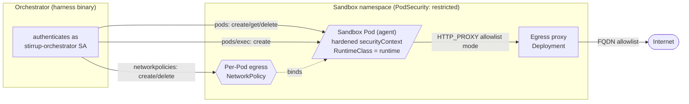

# Kubernetes executor

The `k8s` executor runs the agent inside a hardened, single-use
**sandbox Pod** rather than a local Docker/Podman container. It is the
executor for running stirrup *on* a Kubernetes cluster: an orchestrator
process (the harness binary holding a kubeconfig or in-cluster
ServiceAccount) creates one Pod per run, drives command execution and
file I/O over the `pods/exec` subresource, confines the Pod's egress
with a per-Pod `NetworkPolicy`, and deletes the Pod when the run ends.

This document is the operator reference. The reference manifests it
points at live under [`examples/k8s/`](../../examples/k8s/) and the
local development cluster under [`scripts/dev/`](../../scripts/dev/).
The executor implementation is
[`harness/internal/executor/k8s.go`](../../harness/internal/executor/k8s.go)
and [`k8s_netpol.go`](../../harness/internal/executor/k8s_netpol.go);
every flag, field, and label documented here is cross-checked against
those files.

## Contents

- [When to use it](#when-to-use-it)
- [Architecture](#architecture)
- [Configuration reference](#configuration-reference)
- [Deployment recipes](#deployment-recipes)
- [RuntimeClass selection per run](#runtimeclass-selection-per-run)
- [Egress](#egress)
- [Safety rings on Kubernetes](#safety-rings-on-kubernetes)
- [Sandbox identity token exposure](#sandbox-identity-token-exposure)
- [Troubleshooting](#troubleshooting)
- [Testing the executor against a real cluster](#testing-the-executor-against-a-real-cluster)

## When to use it

| Executor | Boundary | Use when |
|---|---|---|
| `local` | none (host process) | Trusted local iteration. |
| `container` | a Docker/Podman container on the harness host | A single host with a container engine is the deployment target. |
| `k8s` | a Pod on a Kubernetes cluster | The deployment target is a cluster; multi-tenant isolation, per-tenant RuntimeClass, and cluster-native NetworkPolicy egress are required. |

The `k8s` executor is the cluster-native analogue of the `container`
executor. The two share the `image`, `network`, `resources`, and
`runtime` configuration surface; the differences are that the sandbox
is a Pod (not a host container), the runtime maps to a Pod
`RuntimeClassName` (not a host OCI runtime), and egress is enforced by
a `NetworkPolicy` plus an in-cluster proxy Deployment (not an in-process
host proxy).

### Variant: provisioning via the Agent Sandbox CRD

On a cluster running the GKE Agent Sandbox controller, the
[`k8s-sandbox` executor](k8s-agent-sandbox.md) provisions the same
hardened sandbox Pod through an `agents.x-k8s.io/v1alpha1` **Sandbox**
custom resource instead of creating the Pod directly. It reuses every
`K8s*` flag, the hardened Pod spec, and the per-Pod egress
`NetworkPolicy` documented here; it differs only in *who owns the Pod*
(the controller, not the orchestrator) and is gVisor-only. See
[`k8s-agent-sandbox.md`](k8s-agent-sandbox.md) for the deltas.

## Architecture



The pieces and their lifecycle:

- **The orchestrator** is whatever runs the harness (a CI runner, a
  controller, an operator shell). It authenticates with the cluster in
  this order (see
  [`buildRESTConfig`](../../harness/internal/executor/k8s.go)): an
  explicit kubeconfig at `executor.k8sKubeconfig` if set (it wins even
  when running in-cluster), then the in-cluster ServiceAccount, then
  `$KUBECONFIG`. It holds the RBAC the executor's lifecycle needs:
  `pods` (create/get/delete), `pods/exec` (create), and
  `networkpolicies` (create/delete). The reference Role
  ([`examples/k8s/rbac.yaml`](../../examples/k8s/rbac.yaml)) also grants
  `pods/log` (get); the executor does not use it, so it is granted only
  for operator `kubectl logs` debugging and may be dropped to tighten
  the Role to the executor's minimum.

- **The sandbox Pod** is created per run with a fixed, config-independent
  hardened `securityContext`: `allowPrivilegeEscalation: false`,
  `capabilities.drop: [ALL]`, `runAsNonRoot: true`, `runAsUser: 65532`
  (the distroless "nonroot" UID), and `seccompProfile.type:
  RuntimeDefault`. `automountServiceAccountToken` is **always** `false`,
  so the sandbox itself has no Kubernetes API access regardless of the
  ServiceAccount named. `restartPolicy` is `Never` (one-shot), the
  container is named `agent`, and the entrypoint is `/bin/sh -c "sleep
  infinity"` — all real work runs through subsequent `exec` calls, not
  the entrypoint. The working directory `/workspace` is an `emptyDir` the
  executor mounts, with pod `securityContext.fsGroup: 65532`, so the
  workspace is writable by the non-root UID for *any* image that ships a
  shell — the image need not pre-create a writable `/workspace`, and the
  volume is wiped per Pod. (This mirrors the container executor's writable
  host bind mount; both hide any content an image bakes at that path.) The
  exact spec is annotated field-by-field in
  [`examples/k8s/sample-sandbox-pod.yaml`](../../examples/k8s/sample-sandbox-pod.yaml).

- **Command execution and file I/O** both ride the `pods/exec`
  subresource. `Exec` runs `/bin/sh -c`; `ReadFile`/`WriteFile` stream a
  `tar` archive over exec; `ListDirectory` runs `ls -A1`. The image must
  therefore ship a POSIX shell at `/bin/sh` plus `tar` and `ls` on
  `PATH` — a shell-less distroless static image will not work. Output
  and file payloads are capped at 10 MB (matching the container
  executor).

- **Egress** is enforced by a per-Pod `NetworkPolicy` the executor
  installs *before* the Pod is created (closing the window in which a
  Running Pod would otherwise have cluster-default egress). Mode `none`
  installs a deny-all egress policy; mode `allowlist` installs a policy
  permitting egress only to DNS and the in-cluster egress proxy, and
  injects `HTTP_PROXY`/`HTTPS_PROXY`/`NO_PROXY` into the container. See
  [Egress](#egress).

The label contract knits these together: every sandbox Pod carries
`stirrup-sandbox: "true"` and `stirrup.dev/pod: <pod-name>`, and the
allowlist policy selects the proxy by `app=stirrup-egress-proxy` on TCP
8080. These labels are fixed in `k8s_netpol.go`; the manifests must keep
them in sync.

## Configuration reference

The `k8s` executor is selected by `--executor k8s` /
`executor.type: "k8s"`. It draws on the shared executor fields (`image`,
`network`, `resources`, `runtime`) plus a set of `K8s*` fields. Every
flag and field below is verified against
[`runconfigflags.go`](../../harness/cmd/stirrup/cmd/runconfigflags.go),
[`harness.go`](../../harness/cmd/stirrup/cmd/harness.go), and
[`types/runconfig.go`](../../types/runconfig.go).

### Flags and fields

| CLI flag | RunConfig field | Required | Notes |
|---|---|---|---|
| `--executor k8s` | `executor.type: "k8s"` | yes | Selects the executor. |
| `--image` | `executor.image` | yes for `k8s` | Pod container image. Must ship `/bin/sh`, `tar`, and `ls`. |
| `--k8s-namespace` | `executor.k8sNamespace` | yes for `k8s` | Namespace the sandbox Pod (and its `NetworkPolicy`) is created in. |
| `--k8s-kubeconfig` | `executor.k8sKubeconfig` | no | Path to a kubeconfig file. Empty prefers in-cluster config, then `$KUBECONFIG`. |
| `--k8s-node-selector key=value` | `executor.k8sNodeSelector` | no | Repeatable `nodeSelector` constraint, e.g. `--k8s-node-selector disktype=ssd`. Merged with any `nodeSelector` the RuntimeClass contributes. |
| `--k8s-service-account` | `executor.k8sServiceAccount` | no | ServiceAccount name for the Pod. Empty uses the namespace `default`. The token is never automounted regardless. |
| `--k8s-egress-proxy-url` | `executor.k8sEgressProxyUrl` | conditional | Egress proxy URL the Pod's `HTTP_PROXY`/`HTTPS_PROXY` point at. Required when `network.mode` is `allowlist`; rejected otherwise. |
| `--container-runtime` | `executor.runtime` | no | Pod `RuntimeClassName`. Closed set: `runc`, `gvisor`, `kata-qemu`, `kata-fc`, `kata-clh`. Empty selects the cluster-default RuntimeClass (and logs an isolation warning). |
| *(RunConfig only)* | `executor.network` | yes for `k8s` | Mode `none` or `allowlist`. A nil network is rejected at config load (fail closed). |
| *(RunConfig only)* | `executor.resources` | no | CPU/memory/disk mapped onto the Pod container. See [Resource mapping](#resource-mapping). |

`--container-runtime` is shared with the `container` executor, where it
names a host OCI runtime. For `k8s` the same field names a Pod
`RuntimeClassName`, which is **not** the same namespace of values: the
closed set for `k8s` is `runc / gvisor / kata-qemu / kata-fc / kata-clh`
(`gvisor`, not the OCI runtime name `runsc`). Shell completions list the
container set only, so `gvisor` is valid but not offered by completion.

### Validation rules

`ValidateRunConfig` enforces the following for `executor.type: "k8s"`
(see `validateK8sExecutor` / `validateK8sEgressProxy` /
`validateExecutorRuntime` in
[`types/runconfig.go`](../../types/runconfig.go)):

- `executor.image` is **required**.
- `executor.k8sNamespace` is **required**.
- `executor.workspace` is **rejected** — the Pod workspace is fixed at
  `/workspace`, not a mapped host directory.
- `executor.network` is **required** (set `mode` to `none` or
  `allowlist`). A nil network leaves egress posture undefined and is
  surfaced at config-load time rather than at runtime.
- `executor.k8sEgressProxyUrl` is **required** when `network.mode` is
  `allowlist` and **rejected** when it is not.
- `executor.runtime`, when non-empty, must be one of the closed set
  `runc / gvisor / kata-qemu / kata-fc / kata-clh`; any other value is
  rejected.
- `executor.resources`, when set, must not carry negative values — a
  negative bound would silently map to "no limit".

### Resource mapping

`executor.resources` maps onto the Pod container as follows
(`resourcesToPodResources`):

| Field | Pod mapping |
|---|---|
| `cpus` | `requests.cpu` **and** `limits.cpu`. Whole cores render as an integer (`"2"`), fractional cores as milli-CPU (`"500m"`). |
| `memoryMb` | `requests.memory` **and** `limits.memory` (Mi). |
| `diskMb` | `limits.ephemeral-storage` **only** (Mi) — the eviction ceiling. No request, so the scheduler is not forced to find a node with that much free scratch. |
| `pids` | **Logged and ignored.** Per-Pod PID limits are a kubelet setting (`--pod-max-pids`), not a container resource field. |

A nil or all-zero `resources` block leaves the Pod's requirements empty
so it inherits namespace defaults.

## Deployment recipes

Each recipe below is a `kind`/cluster bring-up plus the run invocation.
The standing objects (namespace, RBAC, RuntimeClasses) come from
[`examples/k8s/`](../../examples/k8s/); apply them once per cluster:

```sh
kubectl apply -f examples/k8s/namespace.yaml
kubectl apply -f examples/k8s/rbac.yaml
kubectl apply -f examples/k8s/runtimeclass.yaml   # registered handlers only
```

Register only the RuntimeClasses whose handlers are actually installed
on the nodes — a RuntimeClass whose handler is missing makes Pod
scheduling fail. The recipes set `--mode execution` and a network mode;
fill in the provider/model and prompt as for any run.

### kind + runc (manifest-shape smoke test)

A stock `kind` cluster runs every Pod under `runc` and does **not**
enforce `NetworkPolicy` (its default CNI, kindnet, accepts policy objects
but ignores them). This recipe proves the executor can create, exec
into, and tear down a Pod — it does **not** prove egress confinement.

```sh
./scripts/dev/kind-up.sh        # or: just kind-up
kubectl config use-context kind-stirrup-sandbox

stirrup harness \
  --executor k8s \
  --image ghcr.io/rxbynerd/stirrup-sandbox:latest \
  --k8s-namespace stirrup-sandbox \
  --mode execution \
  --prompt "..."
# network.mode comes from a RunConfig; use "none" for the smoke test.
```

### kind + gVisor (sandboxed runtime, unenforced egress)

`scripts/dev/kind-up.sh` installs gVisor (`runsc` + the containerd shim)
into the kind node and registers a `gvisor` RuntimeClass, so a Pod can
schedule onto a kernel-isolated runtime. Egress is still unenforced on
kindnet — combine gVisor with a real CNI for the full posture.

```sh
./scripts/dev/kind-up.sh        # installs gVisor + RuntimeClasses
./scripts/dev/smoke-test.sh     # or: just kind-smoke — verifies gVisor runs

stirrup harness \
  --executor k8s \
  --image ghcr.io/rxbynerd/stirrup-sandbox:latest \
  --k8s-namespace stirrup-sandbox \
  --container-runtime gvisor \
  --mode execution \
  --prompt "..."
```

Kata backends are deliberately absent from the kind dev cluster: kind
nodes are themselves containers and Kata needs nested KVM, which is not
available inside a containerised host. Exercise Kata on a real cluster.

### GKE Sandbox (gVisor on GKE) — end-to-end walkthrough

GKE is the reference managed target. GKE Sandbox runs Pods under gVisor
(no node-level install — GKE manages it) and GKE Dataplane V2 (Cilium)
enforces `NetworkPolicy`, so **both** halves of the sandbox posture —
kernel isolation *and* egress confinement — are real here, unlike on a
stock `kind` cluster. The steps below take a cluster from zero to a
verified sandbox run.

#### 1 — Cluster and Sandbox node pool

Two cluster properties are load-bearing:

- **Dataplane V2** (`--enable-dataplane-v2`, i.e. `networkConfig.
  datapathProvider: ADVANCED_DATAPATH`) so the per-Pod egress
  `NetworkPolicy` the executor installs is actually enforced. The legacy
  Calico network-policy addon is unnecessary (and mutually exclusive).
- A **GKE Sandbox node pool** (`--sandbox type=gvisor`) for the gVisor
  RuntimeClass.

```sh
gcloud container clusters create CLUSTER \
  --zone ZONE --enable-dataplane-v2

gcloud container node-pools create sandbox \
  --cluster CLUSTER --zone ZONE \
  --sandbox type=gvisor --machine-type e2-standard-4
```

GKE Sandbox node pools are **x86**, taint themselves
`sandbox.gke.io/runtime=gvisor:NoSchedule`, and GKE creates a *managed*
`gvisor` RuntimeClass (handler `gvisor`) whose `scheduling` carries the
matching `nodeSelector` and toleration. Two consequences:

- The sandbox **image must be amd64-compatible** (or multi-arch).
- `--container-runtime gvisor` targets the managed class directly; the
  Pod schedules onto the Sandbox pool with the toleration injected for
  it, so `--k8s-node-selector sandbox.gke.io/runtime=gvisor` is redundant
  (add `--k8s-node-selector` only to *further* constrain placement).

> **Do not apply this repo's `gvisor` RuntimeClass on GKE.** The `gvisor`
> entry in
> [`examples/k8s/runtimeclass.yaml`](../../examples/k8s/runtimeclass.yaml)
> describes a *self-managed* gVisor install (`handler: runsc`,
> `stirrup.dev/runtime-gvisor` nodeSelector) and conflicts with the
> GKE-managed object. On GKE apply only `namespace.yaml` and `rbac.yaml`.

#### 2 — Connect to the control plane

```sh
# Public-endpoint cluster:
gcloud container clusters get-credentials CLUSTER --zone ZONE

# Private-endpoint cluster (control plane unreachable from outside the
# VPC): register it to a fleet and reach the API server through Connect
# Gateway instead of the private endpoint.
gcloud services enable connectgateway.googleapis.com
gcloud container fleet memberships get-credentials CLUSTER
```

Both paths need the `gke-gcloud-auth-plugin` (`gcloud components install
gke-gcloud-auth-plugin`). The executor negotiates **WebSocket-first** for
the `pods/exec` stream (SPDY fallback), so exec and file I/O work through
the Connect Gateway proxy — not only against a directly-reachable API
server.

#### 3 — Standing objects

```sh
kubectl apply -f examples/k8s/namespace.yaml   # stirrup-sandbox, restricted PSS
kubectl apply -f examples/k8s/rbac.yaml        # orchestrator SA + Role/RoleBinding
# (skip runtimeclass.yaml on GKE — see the note in step 1)
```

#### 4 — Egress proxy (network mode `allowlist` only)

For `network.mode: allowlist`, deploy the proxy from
[`examples/k8s/egress-proxy/`](../../examples/k8s/egress-proxy/) into the
**same namespace** as the sandbox; see that directory's README for the
namespace-alignment requirement and the GKE scheduling note (the proxy
needs an amd64-or-multi-arch image and either a non-Sandbox node pool or
`runtimeClassName: gvisor` to tolerate the Sandbox-pool taint). Skip this
step entirely for `network.mode: none`.

#### 5 — Run

`network.mode` has no CLI flag; it lives in a `--config` RunConfig.
[`examples/runconfig/k8s-gvisor.json`](../../examples/runconfig/k8s-gvisor.json)
is a ready starting point (`executor.network.mode: none`); for allowlist
mode set `network.mode: "allowlist"` and `executor.k8sEgressProxyUrl`.

```sh
stirrup harness \
  --config examples/runconfig/k8s-gvisor.json \
  --k8s-kubeconfig ~/.kube/config \   # the get-credentials / Connect Gateway context
  --prompt "Create greeting.txt containing 'hello from the gvisor sandbox', then cat it."
```

Alternatively run the orchestrator **in-cluster** as a Pod/Job under the
`stirrup-orchestrator` ServiceAccount (`stirrup job` — see
[`docs/deployment.md`](../deployment.md)); leaving `executor.k8sKubeconfig`
empty then prefers the in-cluster config.

#### 6 — Verify gVisor is in force

A trivial exec confirms the sandbox actually runs under gVisor rather
than silently falling back to the host runtime: `uname -r` reports a
synthetic kernel version (observed `4.4.0`) and `dmesg` shows a `Starting
gVisor...` banner — both distinct from the host kernel.

```sh
POD=$(kubectl -n stirrup-sandbox get pod -l stirrup-sandbox=true \
  -o jsonpath='{.items[0].metadata.name}')
kubectl -n stirrup-sandbox exec "$POD" -- sh -c 'uname -r; dmesg | grep -i gvisor'
```

### Kata Containers (kata-qemu / kata-fc / kata-clh)

The three Kata backends give hardware-virtualization isolation: each Pod
runs in a lightweight VM. They are **not** interchangeable on one node —
`kata-fc` needs a devmapper snapshotter, `kata-clh` a different VMM — so
[`examples/k8s/runtimeclass.yaml`](../../examples/k8s/runtimeclass.yaml)
gives each a **distinct** `nodeSelector` label. Label each node only for
the handler(s) it actually has:

```sh
kubectl label node <node> stirrup.dev/runtime-kata-qemu=true
kubectl label node <node> stirrup.dev/runtime-kata-fc=true
kubectl label node <node> stirrup.dev/runtime-kata-clh=true
```

Then select the matching runtime per run:

```sh
# kata-qemu — broadest compatibility, needs KVM (bare metal or nested virt)
stirrup harness --executor k8s --container-runtime kata-qemu \
  --image ghcr.io/rxbynerd/stirrup-sandbox:latest \
  --k8s-namespace stirrup-sandbox --mode execution --prompt "..."

# kata-fc — Firecracker, fast boot, needs a devmapper snapshotter + KVM
stirrup harness --executor k8s --container-runtime kata-fc \
  --image ghcr.io/rxbynerd/stirrup-sandbox:latest \
  --k8s-namespace stirrup-sandbox --mode execution --prompt "..."

# kata-clh — Cloud Hypervisor, needs KVM
stirrup harness --executor k8s --container-runtime kata-clh \
  --image ghcr.io/rxbynerd/stirrup-sandbox:latest \
  --k8s-namespace stirrup-sandbox --mode execution --prompt "..."
```

Kata prerequisites are documented inline in
[`examples/k8s/runtimeclass.yaml`](../../examples/k8s/runtimeclass.yaml).
The RuntimeClass's `scheduling.nodeSelector` and any
`--k8s-node-selector` the run supplies are merged by Kubernetes into the
effective node selection.

## Running the orchestrator in-cluster

The orchestrator (the process running `stirrup harness`) and the sandbox
Pod are distinct: the orchestrator resolves provider credentials and drives
the run; the sandbox only executes tools. Where the orchestrator runs
determines which provider credential sources are reachable.

The metadata-server credential sources — `gcp-workload-identity` /
`gcp-default` for Vertex AI Gemini, and `anthropic-wif` with the
`gke-metadata` token source for Anthropic — read from
`metadata.google.internal`, reachable **only from inside the cluster**.
Driving them from a laptop fails fast (`not running on GCE`). To use GKE
Workload Identity for provider auth, run the orchestrator in-cluster as a
`Job` under a ServiceAccount bound to a GCP service account via Workload
Identity. This holds under the `gvisor` RuntimeClass: a gVisor-sandboxed
orchestrator reaches the metadata server and mints both GCP access tokens
and Google OIDC identity tokens normally.

A standalone in-cluster `Job` running `stirrup harness` (no control plane)
is the lightest shape — the executor falls back to the in-cluster
ServiceAccount, so no kubeconfig is mounted. The `stirrup job` +
control-plane shape in [`deployment.md`](../deployment.md) is the
production alternative.

Two requirements are easy to miss:

- **`automountServiceAccountToken: true` on the orchestrator Pod.** The
  reference orchestrator ServiceAccount sets `automountServiceAccountToken:
  false` on the SA object
  ([`rbac.yaml`](../../examples/k8s/rbac.yaml)), so a Pod that does not
  re-enable it has no projected token and the executor's in-cluster REST
  config fails with `open
  /var/run/secrets/kubernetes.io/serviceaccount/token: no such file or
  directory`. Set the field on the orchestrator Pod spec. The sandbox Pod
  the executor creates still runs with its token un-mounted — that is
  enforced separately and unaffected.
- **Scheduling onto an amd64 / RuntimeClass-appropriate node.** On a GKE
  Sandbox cluster the only amd64 nodes are the gVisor pool, so the
  orchestrator Pod needs `runtimeClassName: gvisor` (which injects the pool
  toleration) or a dedicated untainted pool.

**`terminationGracePeriodSeconds` on the orchestrator Pod.** Kubernetes
sends SIGTERM to the orchestrator process on Pod deletion/eviction/scale-
down, then SIGKILL after the grace period — 30 seconds by default when
the field is unset. Stirrup's signal handler
(`harness/cmd/stirrup/cmd/root.go::setupSignalHandler`) cancels the run
context on SIGTERM, letting the trace emitter flush and
`workspaceExportTo` upload before the kill. A run configuring `postRun`
lifecycle hooks (issue #461) is a partial exception: those hooks
deliberately run on a context detached from the run's own deadline/
cancellation so an in-flight artifact upload can survive it, but the
harness still observes SIGTERM directly on that detached context
(`AgenticLoop.Shutdown`) and cuts a `postRun` hook short promptly rather
than letting it run for its full configured budget (up to 1830s). A
background watchdog additionally bounds executor teardown — deleting
the sandbox Pod and its egress `NetworkPolicy` — to 5 seconds after
SIGTERM even if `Run()` has not yet returned, so cleanup completes well
inside the default 30-second grace window regardless of what an
in-flight `postRun` hook is doing. Set `terminationGracePeriodSeconds`
explicitly on the orchestrator Pod spec when running with long `postRun`
hooks, sized for the run's own `timeout` plus normal shutdown overhead —
the default 30 seconds is ample headroom over the harness's own 5-second
proactive-teardown bound, but a cluster with a tighter eviction/
preemption grace period should account for it.

Provider auth is **orthogonal to sandbox egress**. The orchestrator's
provider call (to Anthropic / Vertex / an OpenAI-compatible endpoint) is
made from the orchestrator Pod, not the sandbox, so a sandbox
`network.mode: allowlist` that omits the provider host does not block the
run — the allowlist constrains only the sandbox Pod's own traffic. (When
the orchestrator Pod is itself subject to a namespace egress
`NetworkPolicy`, it needs its own allowances for the provider endpoint, the
metadata server, DNS, and the in-cluster API server.)

## RuntimeClass selection per run

`executor.runtime` maps directly to the Pod `RuntimeClassName`, so a
multi-tenant orchestrator selects the isolation level per run by setting
the field. A cluster can register the full set and route each tenant to
the appropriate class:

- Low-trust / untrusted prompts → `gvisor` or a `kata-*` backend.
- Trusted internal workloads → `runc` (or leave empty for the cluster
  default, accepting the isolation warning the executor logs).

An empty `executor.runtime` leaves `RuntimeClassName` unset, which
selects the cluster-default RuntimeClass — often plain `runc` with no
sandbox isolation. The executor logs a warning in that case so the
opt-out is visible; a run wanting guaranteed isolation must set the
field explicitly.

Node isolation for sandbox runtimes is a `taint`/`toleration` pattern,
documented (but **not yet implemented** by the executor — it does not
inject tolerations) in
[`examples/k8s/taint-and-toleration.yaml`](../../examples/k8s/taint-and-toleration.yaml).

## Egress

The `k8s` executor's network posture comes from `executor.network.mode`,
and the matching `NetworkPolicy` is installed before the Pod exists.

### Mode `none` — deny all egress

A deny-all egress `NetworkPolicy` (an `Egress` policy type with no egress
rules) selects the Pod and permits no outbound traffic. No proxy and no
proxy env vars are involved.

### Mode `allowlist` — proxy + DNS

The policy permits egress only to (a) DNS (UDP/TCP 53) and (b) the
in-cluster egress proxy (`app=stirrup-egress-proxy` on TCP 8080).
Everything else is forced through the proxy, where the FQDN allowlist
applies. The executor injects:

```
HTTP_PROXY  = <k8sEgressProxyUrl>
HTTPS_PROXY = <k8sEgressProxyUrl>
NO_PROXY    = localhost,127.0.0.1,::1
```

The `NO_PROXY` set (`localhost,127.0.0.1,::1`) is fixed in the executor
and not flag-configurable.

The `NetworkPolicy` intentionally does **not** encode the FQDN allowlist
— NetworkPolicy operates on IPs/ports/selectors, not hostnames. The
hostname allowlist lives in the proxy. The policy's job is the
complementary half: guarantee the Pod cannot reach the network except
via the proxy.

### The egress proxy

The proxy is the same allowlist proxy the `container` executor runs
in-process, deployed as a long-lived in-cluster Deployment many sandbox
Pods share (a Pod cannot start its own host-side proxy). Deploy it from
[`examples/k8s/egress-proxy/`](../../examples/k8s/egress-proxy/), or run
it standalone with the `stirrup egress-proxy` subcommand:

```sh
stirrup egress-proxy --listen :8080 \
  --allowlist api.anthropic.com --allowlist '*.github.com:443'
# or read the allowlist from a file:
stirrup egress-proxy --listen :8080 --allowlist-file ./allowlist.txt
```

The proxy reads its allowlist once at startup (no hot reload); roll the
Deployment to change it. During a rolling update, in-flight runs keep
routing through the old Pod (and its old allowlist) until the new Pod is
Ready; pause runs across the roll if that overlap window is
unacceptable.

**The proxy MUST run in the same namespace as the sandbox Pod.** The
allowlist policy selects the proxy by a `PodSelector` with **no**
`NamespaceSelector`, so a cross-namespace proxy is not matched: under an
enforcing CNI the sandbox then gets *no* egress at all (a silent deny,
not a bypass). Set `--k8s-namespace` and the proxy's namespace to the
same value, and point `--k8s-egress-proxy-url` at the
`<service>.<namespace>.svc` name — for example
`http://stirrup-egress-proxy.stirrup-sandbox.svc:8080`. The
top-level `examples/k8s/` manifests use `stirrup-sandbox` while
`egress-proxy/` ships `default`; align them before applying (see the
[examples README](../../examples/k8s/README.md#namespace-alignment--required-before-applying-the-egress-proxy)).

### Git-credential proxy (haybale) deployment

A run using `executor.sandboxIdentity` / `executor.gitProxy` (issue
#516, see [`configuration.md`'s "Sandbox identity and git-proxy
wiring"](../configuration.md#sandbox-identity-and-git-proxy-wiring))
routes git operations through a git-credential proxy such as
[haybale](https://github.com/rxbynerd/haybale) rather than through
`github.com` directly. Deploy haybale as its own Service beside
`stirrup-egress-proxy` — in-cluster, in the same namespace, or
otherwise reachable through the allowlist proxy — and add its
`host:port` to the run's `network.allowlist` (the FQDN matching rule
above applies identically: suffix the port when it isn't 443). See
haybale's own
[`docs/stirrup-integration.md`](https://github.com/rxbynerd/haybale/blob/main/docs/stirrup-integration.md)
("Deployment") for haybale's own deployment shape and scheduling
notes. haybale is a separate component from `stirrup-egress-proxy`,
not a replacement for it: the sandbox's outbound HTTP still transits
the egress proxy exactly as before, with haybale simply being one more
allowlisted destination on the other side of it.

### Enforcement caveat — kindnet does not enforce NetworkPolicy

`NetworkPolicy` is enforced only by a CNI that implements it. **kindnet,
the default CNI for `kind`, accepts NetworkPolicy objects but does not
enforce them.** On a stock kind cluster the deny-all and allowlist
policies are inert, and a sandbox Pod retains cluster-default egress.
The confinement holds only on a NetworkPolicy-enforcing CNI such as
[Cilium](https://cilium.io/) or
[Calico](https://www.tigera.io/project-calico/).

Treat a kind-based test as proof of *manifest shape* — the objects are
created with the right selectors, ports, and env — not as proof that
egress is actually confined. This mirrors the `container` executor's
honest fail-open note around `host.docker.internal`.

## Safety rings on Kubernetes

The five [safety rings](../safety-rings.md) map onto the `k8s` executor
as follows. The full per-ring detail is in
[`docs/safety-rings.md`](../safety-rings.md#safety-rings-on-kubernetes);
the K8s-specific mapping is:

| Ring | On Kubernetes |
|---|---|
| **1 — Runtime class** | `executor.runtime` is the Pod `RuntimeClassName`, not a host OCI runtime. `gvisor` / `kata-*` give kernel/VM isolation; empty selects the cluster default (warned). The hardened `securityContext` (drop ALL, runAsNonRoot, seccomp RuntimeDefault) is applied unconditionally beneath the runtime choice. |
| **2 — Egress proxy** | A per-Pod `NetworkPolicy` plus the in-cluster proxy Deployment, instead of an in-process host proxy. Enforcement depends on a NetworkPolicy-enforcing CNI. |
| **3 — Cedar policy** | Unchanged — per tool-call authorization runs in the orchestrator before the executor acts, identically across executor types. |
| **4 — Rule of Two** | Unchanged — a pre-flight invariant on the `RunConfig`. A non-`none` `network.mode` counts toward `canCommunicateExternally` exactly as for other executors. |
| **5 — Code scanner** | Unchanged — post-edit content check, executor-agnostic. |

Defence-in-depth on K8s additionally relies on cluster-level controls the
reference manifests configure: the sandbox namespace enforces the
`restricted` Pod Security Standard (pinned to a version, not `latest`),
and the orchestrator's RBAC is the minimal `pods` / `pods/exec` /
`networkpolicies` verb set the executor needs (the reference Role adds
`pods/log` get for operator debugging only; drop it to reach the
executor's exact minimum). The sandbox Pod has no API access of its own
(`automountServiceAccountToken: false`).

## Sandbox identity token exposure

**Carried forward from PR C's security review (finding
D-K8S-EXPOSURE).** On the `k8s` and `k8s-sandbox` executors, the
sandbox identity token (issue #516, see [`configuration.md`'s
"Sandbox identity and git-proxy
wiring"](../configuration.md#sandbox-identity-and-git-proxy-wiring))
is injected as a plaintext `corev1.EnvVar` on the Pod spec
(`buildSandboxPodSpec`'s `extraEnv` parameter) — matching haybale's
"pure env, nothing on disk" contract — rather than through a native
Kubernetes `Secret` and `secretKeyRef`.

This broadens the token's exposure relative to a `Secret`-backed
credential:

- **A weaker RBAC bar reads it.** Any principal holding `pods`/`get`
  or `pods`/`list` in the namespace — a materially weaker bar than
  `secrets`/`get` — can read the live token with `kubectl get pod -o
  yaml`. The reference RBAC ([`rbac.yaml`](../../examples/k8s/rbac.yaml))
  already grants the orchestrator `pods`/`get` for its own lifecycle
  management — not `pods`/`list`, which the manifest withholds; the
  residual risk is any *other* principal in the namespace that holds
  either verb, and granting `pods`/`list` beyond what the reference
  manifest does would broaden that exposure further.
- **It lands in etcd in plaintext** absent cluster-wide encryption at
  rest for Pod specs, and in API audit logs if request/response body
  logging is enabled for the `pods` resource.
- **Its lifetime spans the run's whole wall-clock budget** (see
  [`deployment.md`'s "Sandbox identity token
  issuance"](../deployment.md#sandbox-identity-token-issuance-control-plane-implementers),
  "Token lifetime"), materially longer than haybale's recommended
  ≤15-minute `exp` — a longer-lived credential widens the exposure
  window for whatever can reach it by either path above.

Operators running `sandboxIdentity`-configured jobs should scope
`pods`/`get` and `pods`/`list` in the affected namespace as tightly as
`secrets`/`get` is normally scoped — treat Pod read access as
token-equivalent access for the duration of the run.

**Not a current guarantee — a possible v2 hardening.** A future
revision could have the harness create a short-lived, per-run
`Secret` and mount the token via `EnvFrom.SecretKeyRef` instead,
deleting the `Secret` alongside the Pod at teardown. That would move
the token behind the `secrets`/`get` RBAC bar and out of the Pod spec
in etcd, at the cost of the harness needing `secrets` create/delete
RBAC it does not need today. This is tracked as future work, not
something the current implementation provides.

## Troubleshooting

| Symptom | Likely cause | Fix |
|---|---|---|
| `RuntimeClass "<name>" was rejected by the cluster` | The named RuntimeClass is not registered or not permitted. | `kubectl get runtimeclass`; apply [`runtimeclass.yaml`](../../examples/k8s/runtimeclass.yaml) for the handlers actually installed, or pick a registered runtime. |
| `executor.k8sNamespace is required for executor.type="k8s"` | `--k8s-namespace` / `executor.k8sNamespace` unset. | Set the namespace. |
| `executor.k8sEgressProxyUrl is required when ... "allowlist"` | `network.mode: allowlist` without a proxy URL. | Set `--k8s-egress-proxy-url`, or use `network.mode: none`. |
| `executor.k8sEgressProxyUrl is only valid when ... "allowlist"` | A proxy URL set while `network.mode` is `none`. | Remove the URL, or switch to `allowlist`. |
| `executor.network is required for executor.type="k8s"` | No `network` block. | Set `executor.network.mode` to `none` or `allowlist`. |
| `not in cluster and KUBECONFIG is unset` | No in-cluster config, no kubeconfig. | Set `--k8s-kubeconfig` or `$KUBECONFIG`, or run in-cluster. |
| Pod scheduling fails / pending forever | RuntimeClass `nodeSelector` matches no node, or the handler is missing. | Label the node for the runtime; confirm the handler is installed. |
| `0/N nodes available: ... had untolerated taint(s)` (Pod Pending) | The schedulable nodes are tainted (GKE Sandbox pools taint `sandbox.gke.io/runtime=gvisor:NoSchedule`; arch-dedicated pools may add `kubernetes.io/arch=...`) and the Pod tolerates none. | For the Sandbox pool, set `--container-runtime gvisor` so the managed RuntimeClass injects the toleration. For other tainted pools, add a matching `--k8s-node-selector` and ensure a toleration is available (the executor does not inject arbitrary tolerations). |
| Egress not actually confined on `kind` | kindnet does not enforce NetworkPolicy. | Use a NetworkPolicy-enforcing CNI (Cilium, Calico) for real confinement. |
| `pod ... not ready` after the readiness timeout (default 60 s, or the caller context deadline if shorter) | Image lacks `/bin/sh`, or the runtime cannot start the Pod. | Use an image shipping `/bin/sh`, `tar`, `ls`; check `kubectl describe pod`. |
| Exec/file I/O fails with API errors | The orchestrator lacks `pods/exec` create. | Apply [`rbac.yaml`](../../examples/k8s/rbac.yaml) (or grant the verb). |
| `open /var/run/secrets/kubernetes.io/serviceaccount/token: no such file or directory` (in-cluster orchestrator) | The orchestrator Pod's ServiceAccount has `automountServiceAccountToken: false` (the reference SA's default), so no token is projected for the in-cluster REST config. | Set `automountServiceAccountToken: true` on the orchestrator Pod spec. See [Running the orchestrator in-cluster](#running-the-orchestrator-in-cluster). |

## Testing the executor against a real cluster

The executor's own unit tests run with `just test`. A separate
**integration suite** in
[`harness/internal/executor/k8s_test.go`](../../harness/internal/executor/k8s_test.go),
gated by the `integration_k8s` build tag and `STIRRUP_TEST_KUBECONFIG`,
exercises the create→exec→file-I/O→delete lifecycle against a *live*
cluster. A stock `kind` cluster proves manifest shape only; a real
NetworkPolicy-enforcing, gVisor-capable cluster (GKE Sandbox + Dataplane
V2) is what proves the two things kind cannot — **egress is actually
confined** and **gVisor is actually in force**.

The suite is parameterized by environment so it runs against any cluster,
defaulting to the kind-friendly values when a variable is unset:

| Env var | Default | Purpose |
|---|---|---|
| `STIRRUP_TEST_KUBECONFIG` | *(unset → skip)* | Kubeconfig path; also the suite gate. |
| `STIRRUP_TEST_NAMESPACE` | `default` | Sandbox namespace (use `stirrup-sandbox` for the restricted-PSS path). |
| `STIRRUP_TEST_RUNTIME_CLASS` | *(empty)* | Pod `RuntimeClassName` for the generic tests (`gvisor` on GKE Sandbox — a no-RuntimeClass Pod is unschedulable on a fully tainted cluster). |
| `STIRRUP_TEST_RUNTIME_CLASSES` | `,runc,gvisor` | Comma-separated set for `TestK8sRuntimeClass_Admitted` (e.g. `gvisor` alone on GKE). |
| `STIRRUP_TEST_IMAGE` | `busybox:latest` | Sandbox image (amd64/multi-arch for the Sandbox pool; `curlimages/curl:latest` for the allowlist TLS test). |
| `STIRRUP_TEST_EGRESS_PROXY_URL` | `…default.svc:8080` | Allowlist-mode proxy URL. |
| `STIRRUP_TEST_ENFORCE_EGRESS` | *(unset → skip)* | Set to run the enforcement tests (`*_Enforced`); skipped otherwise so kindnet never produces a false negative. |

```sh
# Example: full suite against GKE Sandbox via Connect Gateway.
kubectl config view --minify --flatten \
  --context=connectgateway_PROJECT_global_CLUSTER > /tmp/gw-kubeconfig.yaml

STIRRUP_TEST_KUBECONFIG=/tmp/gw-kubeconfig.yaml \
STIRRUP_TEST_NAMESPACE=stirrup-sandbox \
STIRRUP_TEST_RUNTIME_CLASS=gvisor STIRRUP_TEST_RUNTIME_CLASSES=gvisor \
STIRRUP_TEST_ENFORCE_EGRESS=1 \
STIRRUP_TEST_EGRESS_PROXY_URL=http://stirrup-egress-proxy.stirrup-sandbox.svc:8080 \
  go test -tags integration_k8s -count=1 -v -run TestK8s \
  ./harness/internal/executor/
```

The allowlist enforcement test (`TestK8sEgress_AllowlistEnforced`)
additionally needs a real egress proxy deployed and a TLS-capable image
(`STIRRUP_TEST_IMAGE=curlimages/curl:latest`) — the proxy validates the
TLS SNI, so a raw `CONNECT` without a handshake is rejected.

## See also

- [`k8s-agent-sandbox.md`](k8s-agent-sandbox.md) — the `k8s-sandbox`
  variant that provisions the sandbox via the Agent Sandbox CRD.
- [`examples/k8s/`](../../examples/k8s/) — reference manifests
  (namespace, RBAC, RuntimeClasses, sample Pod, egress proxy).
- [`examples/runconfig/k8s-gvisor.json`](../../examples/runconfig/k8s-gvisor.json)
  — a runnable `k8s` executor RunConfig (gVisor, `network.mode: none`).
- [`scripts/dev/`](../../scripts/dev/) — local `kind` cluster with
  gVisor for development (`just kind-up` / `kind-smoke` / `kind-down`).
- [`docs/safety-rings.md`](../safety-rings.md) — the five-ring model.
- [`docs/configuration.md`](../configuration.md) — full CLI/RunConfig
  reference.
